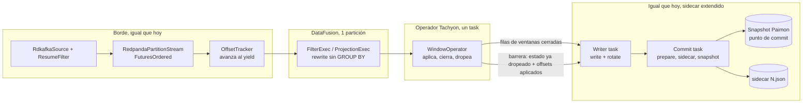
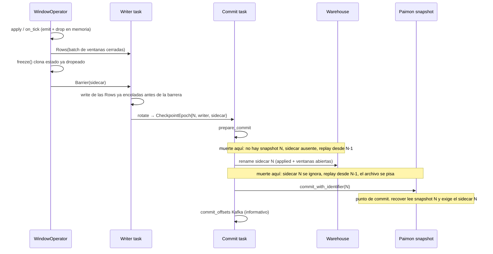

# Exactly-once para agregación por ventanas (TUMBLE, HOP, SESSION)

**Autor:** (placeholder)
**Fecha:** 2026-09-27
**Estado:** Draft
**Repos:** Tachyon (`crates/tachyon-core`, `tachyon-runtime`, `tachyon-sink`, `tachyon-source`, `tachyon-sql`, `tachyon-config`, `tachyon-metrics`)
**Reemplaza:** nada. Extiende el checkpoint que ya persiste `PaimonSink` / `PaimonCommitterHalf`. No implementa el protocolo de `DESIGN.md` §9.2 (redb, barrera multi-input, checkpoint unaligned).

---

## Overview

Un pipeline pass-through es exactly-once porque no retiene filas: cuando el runtime recibe un `RecordBatch` de salida, el `OffsetTracker` ya cubre exactamente los registros de ese batch y de los anteriores, y esos offsets se escriben en `<tabla>/tachyon-offsets/<commit_user>/<id>.json` **antes** del snapshot de Paimon. El snapshot (`commit_identifier = N` bajo un `commit_user` estable) es el único punto de commit. Una ventana rompe el invariante: el registro se aplica a un acumulador abierto mucho antes de que exista una fila de salida, y esa fila solo aparece cuando el watermark cierra la ventana.

Este diseño agrega tres operadores de ventana —`TUMBLE`, `HOP` y `SESSION`— con exactly-once sobre **el mismo** punto de commit. El estado de ventanas abiertas, los offsets de los registros ya aplicados y los watermarks por partición viajan en el sidecar del mismo `commit_identifier`. Se escriben antes del snapshot y no cuentan si el snapshot no existe. DataFusion sigue haciendo solo filter/project. El operador de ventana es de Tachyon. Los planes pass-through no cambian de formato ni de loop.

El join por intervalo queda fuera. El tipo de progreso no cambia: `SourceOffsets` ya es `topic → partición → próximo offset`, así que un segundo input futuro no necesita otro tipo de progreso. Este corte no diseña barreras de dos inputs.

---

## Background y motivación

### Qué garantiza el código hoy

`SourceOffsets` (`crates/tachyon-core/src/types.rs`) es `BTreeMap<String, BTreeMap<i32, i64>>`: próximo offset a consumir, convención Kafka (último incluido + 1).

`RedpandaPartitionStream` avanza el `OffsetTracker` **al emitir** el batch hacia DataFusion, no al hacer poll (`crates/tachyon-source/src/stream.rs`, `OffsetTracker::advance` dentro de `execute`). El decode paralelo no adelanta ese cursor: `FuturesOrdered` publica offsets en orden de despacho, y los lotes todavía en vuelo no están en el tracker.

`run_pipeline` (`crates/tachyon-runtime/src/run.rs`) hace tres cosas que este diseño tiene que conservar en el camino pass-through y no reutilizar a ciegas en el camino de ventanas:

1. `PaimonSink::recover` devuelve los offsets del último snapshot de este `commit_user`. Cada `RdkafkaSource` recibe ese mapa con `with_resume_offsets`. `ResumeFilter` descarta `offset < next` y hace `seek` si el grupo arrancó más adelante (`crates/tachyon-source/src/consumer.rs`).
2. Al recibir un batch de DataFusion, el loop toma `tracker.snapshot()` y lo manda por el canal **junto** con el batch. El writer task fusiona con `merge_offsets` (máximo por partición: el progreso no retrocede).
3. El timer `deployment.commit_interval` (default `10s`; `RunOptions::from_config` no lee `state.checkpoint_interval`) rota el `TableWrite` en O(1). El commit task, en orden, hace `prepare_commit`, escribe el JSON de offsets y llama a `commit_with_identifier`. `commit_epoch` (`crates/tachyon-sink/src/writer.rs`) sale con `Ok(None)` si no hay archivos nuevos y **no** escribe offsets: un epoch sin filas se reprocesa. Eso es correcto para un filter puro e incorrecto para una ventana.

`ensure_passthrough` (`crates/tachyon-runtime/src/execute.rs`) rechaza cualquier operador fuera de `StreamingTableExec`, `CooperativeExec`, `FilterExec`, `ProjectionExec`, `CoalesceBatchesExec`, `GlobalLimitExec`, `LocalLimitExec`, y exige una sola partición de DataFusion. `AggregateExec` queda afuera a propósito: retiene filas y el snapshot del tracker deja de describir lo que llegó al sink (`crates/tachyon-runtime/tests/live_transform.rs`).

`plan_query` fija `target_partitions = 1` y `batch_size = 1` para que el `BatchCoalescer` no retenga un stream infinito. El loop de consumo no cancela `stream.next()`: el timer vive en el writer task.

El `commit_user` sale de `commit_user_from(group_id, instance)` y es estable por proceso (`TACHYON_INSTANCE_ID` / `POD_NAME` / `HOSTNAME`). `last_committed_identifier` recorre snapshots de este `commit_user` e ignora commits batch (`i64::MAX`). Un JSON de offsets sin snapshot se ignora y se sobrescribe: `write_offsets` hace tmp + rename sobre el mismo path.

### Por qué una ventana no entra en ese invariante

Entre el emit hacia DataFusion y una fila en Paimon el operador acumula. Si se commitea el tracker de “lo ya emitido a DataFusion”, la recuperación salta registros aplicados solo en memoria: se pierden. Si se commitean las filas emitidas y el estado sigue conteniendo la ventana, la recuperación las vuelve a emitir. Si se dropea la ventana del estado y el snapshot todavía no contiene la fila, la recuperación no la puede reconstruir.

`DESIGN.md` §9.2 describe otro mecanismo (barrera de Chandy–Lamport, snapshot redb, unaligned, layout `checkpoint-N/redb-part-*.db`). `redb` no está en el `Cargo.toml` del workspace ni hay un módulo de estado. `StateConfig` (`checkpoint_interval`, `checkpoint_storage`, `checkpoint_retention`) se deserializa y no lo consulta nadie. El MVP lo deja explícito: el estado llega después (`MVP.md`). Este corte no construye ese protocolo. Usa el sidecar que el sink ya trata como pre-imagen del snapshot.

La config ya tiene el lag por input: `inputs[].watermark` es `WatermarkConfig { column, lag }` (`crates/tachyon-config/src/schema.rs`). No hay `idle`. Los schemas del repo usan `event_time` como `Int64` (epoch ms); `DESIGN.md` también admite `Timestamp`.

---

## Objetivos y no-objetivos

### Objetivos

- Exactly-once de `TUMBLE`, `HOP` y `SESSION` sobre el checkpoint actual: un `commit_identifier`, un sidecar, un snapshot.
- Al recuperar, restaurar ventanas abiertas **y** seek al próximo offset de los registros ya aplicados. Re-aplicar esos registros está prohibido.
- La emisión de una ventana y el update que la dropea del estado entran en el mismo snapshot que las filas emitidas.
- Lag configurable por el `watermark.lag` que ya existe. `idle` opcional, default = lag. Una query con ventana y sin watermark no arranca.
- Un evento con `event_time < watermark` de instancia se descarta. Sin side output.
- `GROUP BY` incluye `inputs[].key` (`== output.key`). No hay shuffle: el estado vive en la instancia que ya posee la partición de esa clave. Un `GROUP BY` de solo la ventana se rechaza en el arranque (no hay agregado parcial en v1).
- DataFusion queda en filter/project. `ensure_passthrough` sigue cerrando todo lo demás, incluido `AggregateExec`.
- Los planes pass-through (filter/project/limit) corren por el loop actual, con el mismo JSON de offsets.
- Agregados v1: `COUNT`, `SUM`, `MIN`, `MAX`, `AVG` (`AVG` = suma + count en el acumulador).

### No-objetivos

- Interval join, y cualquier join. No hay barrera de dos inputs.
- `COUNT DISTINCT`, `HAVING`, `ORDER BY`, `LIMIT`, `DISTINCT`, `UNION`, expresiones sobre agregados (`SUM(a) * 2`), TVF `TABLE(TUMBLE(...))` de `DESIGN.md` §3.5.
- Side output de late data, allowed lateness más allá del lag, triggers early/late, `STATE_TTL`.
- Cerrar ventanas por processing time. `idle` no empuja el watermark: si todas las particiones están quietas, las ventanas abiertas no se emiten.
- Agregado parcial (`GROUP BY` solo de la función de ventana) y la columna de salida `_tachyon_partition`. v1 no abre una excepción a `validate_config` ni a `PaimonSink::from_table`.
- Usar `HashAggregate` / `AggregateExec` como operador de ventana.
- Introducir `redb` en este corte.
- Checkpoint unaligned y snapshot de buffers in-flight (`DESIGN.md` §9.2.2 fase 2).
- Migrar estado entre `commit_user` cuando un rebalance mueve una partición. Sigue vigente la premisa de `DESIGN.md` §8.1: static membership, la misma instancia conserva sus particiones.
- Alinear el hash de bucket de Paimon con la partición de Kafka (`DESIGN.md` §5.3 no está implementado; el scaling test usa un warehouse por instancia).
- Cambiar el default exactly-once de los pipelines stateless, el presupuesto de CPUs (`StatelessBudget`) ni `batch_size = 1` en la sesión de DataFusion.

---

## Diseño propuesto

### Vista



El camino pass-through no entra a `WindowOperator`. Sigue siendo: yield de DataFusion → snapshot del tracker → writer → `CheckpointEpoch { offsets: SourceOffsets }`.

### Superficie SQL que el planner reconoce

Una sentencia, la misma forma canónica de `tachyon-sql`: `INSERT INTO <out> SELECT ...`. La ventana se reconoce en el AST (`sqlparser`, ya usado por `parse_sql`), no en un plan físico de DataFusion. Forma v1, alineada a `DESIGN.md` §3.1 (no a la TVF de §3.5):

```sql
INSERT INTO orders_lake
SELECT
    order_id,
    window_start,
    window_end,
    COUNT(*)        AS event_count,
    SUM(amount)     AS amount_sum,
    MIN(amount)     AS amount_min,
    MAX(amount)     AS amount_max,
    AVG(amount)     AS amount_avg
FROM orders
WHERE status <> 'cancelled'
GROUP BY order_id, TUMBLE(event_time, INTERVAL '1' MINUTE)
```

Funciones, en el `GROUP BY`, una sola:

| Función | Argumentos | Notas |
|---|---|---|
| `TUMBLE(event_time, INTERVAL size)` | columna, intervalo fijo | Ventanas `[start, end)` alineadas al epoch. `start = ts - rem_euclid(ts, size)`. |
| `HOP(event_time, INTERVAL slide, INTERVAL size)` | slide **después** el tiempo, luego size | Orden de `DESIGN.md` §3.1. `slide` tiene que dividir a `size`. Cada evento cae en `size/slide` ventanas. |
| `SESSION(event_time, INTERVAL gap)` | columna, gap | Por clave. Ver abajo. |

`event_time` es un nombre de columna, no una expresión. El `GROUP BY` solo admite nombres de columna más esa única función, y **tiene** que incluir `inputs[].key`. Intervalos de calendario (`MONTH`, `YEAR`) se rechazan. Las unidades fijas son milisegundo, segundo, minuto, hora y día, este último como `86_400_000` ms exactos (no un día de calendario: un día con DST movería `window_start` y rompería el replay). Todo se normaliza a milisegundos con la misma función que `watermark.lag` / `idle` (sección Config). `size`, `slide` y `gap` tienen que ser `> 0`.

El `SELECT` solo puede nombrar: columnas del `GROUP BY` (no la llamada de ventana), `window_start`, `window_end`, y agregados con alias explícito. Un `FROM` de una sola tabla, que tiene que ser el único `inputs[].name` de una query con ventana. `WHERE` opcional, sin subqueries. Cualquier otra forma (join, TVF, segundo window function, `COUNT(DISTINCT ...)`, agregado anidado, expresión escalar que no es columna ni agregado) se rechaza en el arranque.

El rewrite que sí entra a DataFusion es un project/filter, no la query original:

```sql
SELECT order_id, event_time, amount, _tachyon_partition
FROM orders
WHERE status <> 'cancelled'
```

`_tachyon_partition` lo inyecta el stream **solo** en el camino de ventanas (ver más abajo). El pass-through no gana columnas: el schema que ve Paimon hoy tiene que seguir igual.

#### Errores de arranque

Se evalúan antes de consumir y antes de abrir el consumer. Todos fail-closed.

| Condición | Error |
|---|---|
| Query de ventana y el input no tiene `watermark` | `el input '{name}' alimenta una ventana y no declara watermark (column, lag)` |
| `watermark.column` no es la columna de `TUMBLE`/`HOP`/`SESSION`, o no está en el schema Arrow | error de columna |
| Tipo de la columna distinto de `Timestamp` (cualquier unidad) o `Int64` | error de tipo. `Int64` = epoch ms, que es lo que usan los schemas del repo |
| `lag` o `idle` no matchean `^[0-9]+(ms\|s\|m\|h\|d)$`, o el valor es `<= 0` | error. `"5h"` son 5 horas, no el fallback de 10 s de `parse_duration`. `idle` ausente = `lag` |
| `HOP` y `size_ms % slide_ms != 0` | `HOP: slide ({slide} ms) no divide a size ({size} ms)` |
| El `GROUP BY` no incluye `inputs[].key`, incluido el caso de solo la función de ventana | `GROUP BY de ventana no incluye la clave de particionado '{key}'; v1 no tiene agregado parcial` |
| Columna de `GROUP BY` que no es `Int64` ni `Utf8` | error. Quedan afuera `Boolean`, `Int32`, `Float64`, `Timestamp`, `Date`, `Binary` y el resto. El fast path JSON de `decode.rs` acepta `Boolean`; la ventana no lo usa como clave |
| Columna de `GROUP BY` nullable en el schema Arrow o en el campo de la tabla | error. Entra en la PK y Paimon la exige `NOT NULL`. No se usa `primary-key.nullable` |
| El schema del input o `table.schema().fields()` ya tiene una columna `_tachyon_partition` | `'_tachyon_partition' está reservado`. Es columna interna del camino de ventana, no un campo de la tabla |
| `table.schema().primary_keys()` no es exactamente las columnas de grupo en orden del SQL, luego `window_start` | error de PK. paimon 0.3 expone `TableSchema::primary_keys` (el mismo `schema()` del que `from_table` ya lee `fields()`) |
| La tabla tiene un campo que no es columna de grupo, `window_start`, `window_end` ni un alias de agregado | error. El batch de salida tiene que coincidir con `fields()` en orden y tipos (`write_arrow_batch`) |
| Agregado fuera de COUNT/SUM/MIN/MAX/AVG, o `COUNT DISTINCT` | `agregado no soportado en ventanas exactly-once: {expr}` |
| `SUM`/`MIN`/`MAX`/`AVG` sobre un tipo que no es `Int64` ni `Float64` | error de tipo. `COUNT(col)` acepta la columna que sea; `COUNT(*)` no tiene columna de entrada |
| Alias de agregado ausente | error |
| `output.sequence_field` configurado y esa columna no es una columna determinista de la salida (`window_end` o un alias de agregado) | error. No se usa el offset de Kafka como sequence: muchas filas de entrada colapsan en una |
| La query no es pass-through ni esta forma de ventana | el mensaje actual de `ensure_passthrough` (`exactly-once solo soporta transformaciones por registro...`) |
| El rewrite planificado no pasa `ensure_passthrough` | el mismo mensaje, con el nombre del operador físico. No se ejecuta |

`GROUP BY order_id, status, TUMBLE(...)` es válido si `order_id` es la clave: el estado se clavea por `(order_id, status)` y sigue sin shuffle, porque todos los eventos de `order_id` ya están en esta instancia. `GROUP BY TUMBLE(...)` solo, o `GROUP BY status, TUMBLE(...)` sin `order_id`, no arranca. No es un agregado parcial: `Pipeline::new` llama a `validate_config` antes de mirar la SQL y exige `inputs[].key == output.key` (`validate.rs`). `PaimonSink::from_table` exige que `output.key` sea un campo de la tabla (`writer.rs`). Una fila sin `order_id` no pasa ese par de chequeos, y inventar `output.key: _tachyon_partition` los rompería al revés. v1 no abre esa excepción. El 80 % del caso es la ventana con clave.

PK de Paimon = columnas del `GROUP BY` (orden del SQL, sin la función de ventana) + `window_start`. `AVG` se emite como `sum/count` (`Float64`; null si el count es 0). `SUM` / `MIN` / `MAX` de `Int64` salen `Int64`; los de `Float64` salen `Float64`. El bucket count no se toca: `deployment.partitions == output.bucket`.

#### Semántica de nulls y orden del batch

El `RecordBatch` que entra a `write_arrow_batch` está en el orden de `table.schema().fields()`, no en el orden del `SELECT`. Un `SELECT` que nombra `window_start` antes de `order_id` sigue escribiendo `order_id` primero si así está la tabla. El arranque falla si sobra o falta un campo (tabla de arriba), así que no hay columnas de relleno.

| Agregado | Input | Nulls |
|---|---|---|
| `COUNT(*)` | ninguno (`AggSpec.input = None`) | Cuenta la fila. No mira medidas |
| `COUNT(col)` | la columna | Ignora nulls |
| `SUM` / `MIN` / `MAX` | `Int64` o `Float64` | Ignoran nulls. Si todos son null, la salida es null (SQL), no 0 |
| `AVG` | `Int64` o `Float64` | Ignora nulls. Acumulador `sum: f64` + `count: i64`. Count 0 → null. Si no, `sum/count` en `Float64` |

Cualquier null en una columna de la PK (la clave de particionado o cualquier otra columna del `GROUP BY`) no actualiza `max_event_time`, no abre ventana y no emite fila. Incrementa `tachyon_window_bad_key`. Si el batch termina en `Ok`, el offset queda cubierto: es un drop determinista y el replay lo vuelve a dropear. No es una clave distinta. Un tag de null no entra al mapa ni al batch de Paimon: la PK no acepta null (`create_test_table` no setea `primary-key.nullable`, y este corte tampoco). El arranque ya rechaza la columna si el schema la declara nullable; el drop cubre un null que igual aparezca en el payload. Un `SUM` de `Int64` que no entra en `i64`, y la cota de 512 MiB, no son ese drop: revierten el batch entero y no devuelven `Ok` (más abajo). No se wrapea.

### Qué pasa con `ensure_passthrough`

`ensure_passthrough` se queda. Sigue siendo el chequeo cerrado sobre un `ExecutionPlan`: lista blanca de operadores, una partición, recursivo. No aprende a aceptar `AggregateExec`.

`run_pipeline` deja de llamarlo sobre la SQL cruda. Llama a `admit_exactly_once`:

```rust
pub enum ExactlyOncePath {
    /// Loop actual. El JSON del sidecar sigue siendo un `SourceOffsets` pelado.
    PassThrough,
    /// Rewrite filter/project + `WindowOperator`. Sidecar v1.
    Window(WindowSpec),
}

pub async fn admit_exactly_once(
    select_sql: &str,
    window: Option<&WindowShape>,
    cfg: &PipelineConfig,
    inputs: &[InputSource],
    factory: &StreamTableFactory,
) -> Result<(ExactlyOncePath, Arc<dyn ExecutionPlan>, Arc<TaskContext>)>;
```

`window` sale de `parse_sql` sobre el texto del archivo, no de re-parsear `select_sql`. `Pipeline::run` hoy pasa solo `parsed.select_sql` (`runtime.rs`); el plan tiene que cargar también `ParsedSql.window`.

1. `window == None`: se planifica `select_sql` y `ensure_passthrough` decide. `SELECT status, SUM(amount) FROM orders GROUP BY status` sigue fallando, igual que el test `buffering_plans_are_rejected_for_exactly_once`.
2. `window == Some`: se validan los errores de la tabla anterior, se planifica **solo el rewrite**, y `ensure_passthrough` corre sobre ese plan. Un `RepartitionExec` o un `AggregateExec` colado por el optimizer falla el arranque.
3. No hay un tercer camino que “deje pasar” otro operador buffering.

`plan_query` sigue fijando `target_partitions = 1` y `batch_size = 1` en los dos caminos. Sin eso, `CoalesceBatchesExec` retiene batches y el tracker se adelanta a filas que el operador no vio como lote cerrado.

### Modelo de progreso y dónde se mueve el cursor

Hay dos cursores. No se mezclan.

| Camino | Quién avanza el tracker | Qué se commitea |
|---|---|---|
| Pass-through | `OffsetTracker::advance` al yield, como hoy | El writer **no** reemplaza el mapa por `tracker.snapshot()`. Lo siembra con el checkpoint recuperado y hace `merge_offsets` (`run.rs`, el comentario «para arrastrar las particiones que no avanzan»). El tracker nace vacío y solo inserta particiones que ya yieldearon (`stream.rs`) |
| Ventana | El mismo advance al yield | `applied` se siembra con el sidecar restaurado o, si no hay checkpoint, con el low watermark después de `rd_kafka_committed`. Solo recibe `merge_offsets` del snapshot **después** de que `apply` devolvió `Ok` en el batch entero. La barrera persiste ese mapa. Nunca se reemplaza |

`applied` usa el tipo `SourceOffsets` que ya existe (por topic). Incluye:

- registros incorporados a un acumulador;
- late drops (`event_time < watermark`): el efecto ya se decidió, no se vuelven a leer;
- filas que el `FilterExec` se comió enteras dentro del `next()` que acaba de volver. Esas filas no cambian estado, pero el tracker ya las publicó porque DataFusion las consumió para producir este resultado. Avanzarlas es el mismo criterio que el pass-through, y el filter es determinista.

No incluye, y un checkpoint no puede incluir:

- prefetch de librdkafka y el canal mpsc de poll (16 lotes, `RdkafkaSource::record_stream`);
- el acumulador de `RedpandaPartitionStream` que todavía no llegó a `spawn_decode`;
- lotes dentro de `FuturesOrdered` que no se yieldearon (el tracker avanza **después** del `in_flight.next()`, junto con el yield);
- un batch que `stream.next()` todavía no devolvió al operador;
- filas de salida sentadas en el canal hacia el writer. Esas filas son el producto de registros cuyo `applied` ya avanzó en memoria, pero el cursor commiteado es el de la última barrera cuyo snapshot existe. Si el proceso muere con el canal lleno, se restaura la barrera anterior y esos registros se vuelven a leer. No quedaron aplicados en el estado restaurado.

El operador no fusiona el tracker antes de que `apply` termine bien. `apply` es síncrono en el mismo task, después de que `next()` volvió: en ese momento el tracker ya contiene ese batch (avanzó al yield) y no contiene decodes en vuelo. Si `apply` devuelve `Ok`, `merge_offsets(&mut applied, &tracker.snapshot())`. Las claves que el tracker no menciona se quedan: una partición callada no desaparece del sidecar. Un crash a mitad de `apply` no llega a la barrera; el sidecar anterior no tiene el batch; el replay lo aplica entero.

Si `apply` devuelve `Err` (overflow o cota de memoria), revierte el operador al estado de **antes del batch**, tira las filas de salida que ese `apply` hubiera bufferizado, **no** llama a `merge_offsets` y el proceso sale sin mandar barrera. El tracker ya avanzó al high-water del batch entero en el yield (`stream.rs`, `advance` después de `in_flight.next()`); ese snapshot no se fusiona. No hay checkpoint de un prefijo: la primera fila del batch tampoco queda en el estado restaurado, y el replay vuelve a leer el batch completo. El log del overflow lleva la clave, el `i128`, y la partición y el offset de la fila que disparó el `Err` (el lote los conserva). El restart falla otra vez en esa fila. No hay wrap ni `Float64` silencioso.

Al asignar particiones. `run.rs` arma `consumers_per_topic` `RdkafkaSource` por input (default `min(partitions, cpus)`). Cada uno tiene su `DrainState`. El mapa `applied` es uno solo, del proceso: la unión de esas asignaciones. `native_rebalance_cb` (`consumer.rs` 290–303) hoy ignora `_opaque` y solo hace `rd_kafka_assign`. `ffi_watermarks` es `rd_kafka_query_watermark_offsets` (líneas 233–248), un RPC bloqueante. librdkafka corre `rebalance_cb` en su hilo y no puede servir la respuesta de una llamada bloqueante hecha ahí: deadlock. Lo mismo para `rd_kafka_committed` dentro de ese callback.

El offset de la lista de assign **no es** el commit del grupo. librdkafka deja esa lista en `RD_KAFKA_OFFSET_INVALID` (`-1001`) hasta el OffsetFetch, y `rd_kafka_assignment` repite lo que se le pasó a `rd_kafka_assign`, no lo que tiene el broker (issue 1767 de librdkafka). Con `enable.auto.commit=false` (`run.rs` 162) esa lista también puede traer un offset local viejo `>= 0` que tampoco es el commit del grupo. Leerla como «el grupo ya commiteó», o tratar `-1001` como «el commit informativo no llegó», manda a un segundo `commit_user` al low watermark con estado vacío y pisa la PK del dueño anterior. `ResumeFilter::admit` corre **dentro** de `native_consume_cb`, durante `rd_kafka_poll` (`consumer.rs` 782–792). Un chequeo «después de que poll vuelve y antes de admit» llega tarde para el lote que ese poll ya admitió. Por eso el callback no admite hasta que la consulta terminó.

- En `ASSIGN`, el callback copia solo los ids de partición al `DrainState` (el mismo `opaque` de `native_consume_cb`), pausa esas particiones (`rd_kafka_pause_partitions`, llamada local) y llama a `rd_kafka_assign`. Ignora el campo `offset` de la lista. No llama a `ffi_watermarks` ni a `rd_kafka_committed`. En `REVOKE` publica lo ya copiado en ese poll, marca solo esas particiones y desasigna.
- La consulta de arranque corre **una vez por partición**, y solo si las dos cosas son ciertas: `applied` todavía no tiene esa partición, y este `commit_user` no commiteó ningún snapshot de ventana (ni en `recover`, ni en este proceso). `Recovered::None` es el resultado del arranque y **no** se relee en cada assign: en cuanto el primer snapshot de ventana devuelve `Ok`, un flag en memoria (`snapshot_committed` en `WindowHandoff`) pasa a verdadero y la consulta no vuelve a correr. El task de poll, entre llamadas a `rd_kafka_poll`, llama a `rd_kafka_committed` solo para los ids que cumplen las dos condiciones.
- Mientras una partición no se puede leer (consulta pendiente, o handoff), `native_consume_cb` no la copia. `rd_kafka_yield` no devuelve el mensaje actual a la cola: el trampoline lo destruye después de adelantar el app offset. Por eso la partición está pausada y, al soltarla, se hace seek a `applied`. Una partición que ya está en `applied` y cuyo dueño es este consumidor no espera la consulta.
- Si `rd_kafka_committed` devuelve `offset >= 0` para una partición que sí entró a la consulta, el proceso sale antes de admitir: `este commit_user no tiene checkpoint de ventana pero el grupo '{group}' ya commiteó la partición {p}`. Si el broker no tiene offset, se hace insert-if-absent de `applied[p] = low watermark` (`ffi_watermarks` en esa misma ventana entre polls) y se instala el `ResumeFilter` en ese valor. No hay store ciego: si la clave ya existe, no se toca. `merge_offsets` tampoco sirve para bajarla (toma el máximo). Un grupo nuevo arranca en `earliest`. El primer sidecar nombra a la partición aunque no emita.
- Un assign posterior no repite la consulta de arranque ni baja `applied`. El segundo `RdkafkaSource` del mismo proceso (`consumers_per_topic` default `min(partitions, cpus)`) rebalancea al primero cuando ya puede haber un batch yieldeado. `OffsetTracker::advance` corre al yield, antes de `apply` (`stream.rs` 225–230). `applied` solo se mueve cuando `apply` devuelve `Ok`. Retomar en el `applied` de ese instante, mientras el batch sigue en `FuturesOrdered` o en DataFusion, lo aplica dos veces: el consumer nuevo lo vuelve a leer y el batch viejo también entra al mismo `WindowOperator`. `merge_offsets` guarda un solo high-water y el acumulador queda doblado.
- En `REVOKE` de `p` el consumer viejo deja de admitir `p` y nada más. Hay un solo `RedpandaPartitionStream` por input: el `select_all` de los N consumers alimenta un acumulador y un `FuturesOrdered` (`run.rs`, la factory; `stream.rs`, `execute`). Un lote mezcla particiones. No se tira ese acumulador ni un lote en vuelo: librdkafka ya entregó esos payloads y no los vuelve a entregar. Todo lo que ya entró al stream sigue su curso, yieldea y pasa por `apply`, `p` incluido. `OffsetTracker::advance` es acumulativo (`stream.rs` 225–230): el próximo `merge_offsets` publica el high-water del tracker, no un delta de las filas de este `apply`.
- El consumer nuevo no lee `p` hasta que ese trabajo devolvió `Ok` y el merge dejó `applied[p]` en ese high-water. Recién ahí el `ResumeFilter` arranca en ese `applied[p]`, no en el valor de antes del `apply` ni en el low watermark. Hasta entonces la partición sigue pausada y `native_consume_cb` no copia `p`. Tirar un batch sin `apply` y retomar no existe: el único camino sin `apply` es el `Err` de overflow o de la cota, y el proceso sale antes de cualquier merge posterior. No hay resume después de un drop.
- Restore `Window` (el flag ya arranca en verdadero): si la partición no está en el conjunto **restaurado** y este proceso no la sembró él mismo, `DrainState.fatal` y el proceso sale con `partición {p} de '{topic}' no está en el checkpoint {N} de '{commit_user}'`. No se admite. Una partición quieta que sí estaba en el mapa no dispara esto: `merge_offsets` no borra claves. El seek es el de `applied`, no el de la lista de assign.
- Dos `commit_user` en el mismo `group.id` siguen fuera de v1. El abort de commit ajeno es esa única consulta de `rd_kafka_committed` por partición ausente, antes del primer snapshot de este `commit_user`. No es el campo de la lista de assign y no corre otra vez cuando el dueño ve su propio commit.

`_tachyon_partition` es interno. No sale en la tabla ni en la PK. Hace falta **por fila** porque un batch mezcla particiones de Kafka (`select_all` en la factory de `run.rs`) y el watermark es por partición. No se puede reconstruir desde el `BTreeMap<i32, i64>` de high-water que hoy viaja con el lote.

El decode tira la partición antes de decodificar: `spawn_decode` (`stream.rs`) mueve `Vec<Vec<u8>>` más el high-water al `spawn_blocking`, y `Decoder::decode` solo ve payloads (`decode.rs`). `SourceRecord` (`record.rs`) sí tiene `partition` y `offset`. El lote de la ventana es `Vec<(i32, i64, Vec<u8>)>` —partición, offset, payload— a través de `FuturesOrdered`. `Decoder::new` recibe **solo** el schema del usuario. Si le pasáramos `_tachyon_partition`, el fast path JSON y la proyección Avro la buscarían en el payload (`decode.rs`, `fast_json_type` materializa los campos del schema del decoder). La columna se apendea **después** del decode: `Int32`, no nullable. `RedpandaPartitionStream::partition` no sirve para esto: en producción se construye con `new(0, ...)` (`run.rs`) y es el índice de partición de DataFusion, no el de Kafka.

Dos schemas en el camino de ventana:

- Decoder = columnas del usuario.
- `StreamingTable` y el rewrite = columnas del usuario + `_tachyon_partition`. El `SELECT` reescrito la nombra para que el `ProjectionExec` no la tire. El operador la usa para el watermark y la saca antes de armar el batch de Paimon.

El pass-through no agrega la columna y sigue registrando el schema del usuario. El nombre está reservado: si el input o la tabla ya lo tienen, el arranque falla. Test: un batch con dos particiones de Kafka y la columna igual a esos ids, no al high-water.

### La barrera

Con un solo input la barrera es el `commit_interval` que ya existe. No se inyecta un mensaje de barrera en Kafka y no se espera a un segundo topic.

El `select!` solo elige el wakeup. `apply`, `on_tick`, `freeze` y todos los `tx.send` corren después, sin otra rama que pueda cancelarlos. Un `send` dentro del `select!` se pierde si la otra rama gana: el `RecordBatch` se dropea y la ventana ya cerrada en memoria no tiene fila. Un tick de idle con el canal lleno haría exactamente eso, y `biased` no lo evita. El intervalo de commit es un `Instant`, no un futuro de tick. El tick de 1 s solo despierta cuando el stream está idle.

El futuro de `stream.next()` tampoco se cancela. El loop actual no lo cancela (`run.rs`, el `loop` de `stream.next().await` es plano; el timer está en el writer task). El `RecordStream` de rdkafka es cancel-safe porque el poll está en otro task; el `async_stream` de decode y el `FilterExec` de DataFusion no están especificados como cancel-safe. El task del operador guarda el futuro de `next()` afuera del `select!` y lo pasa por referencia mutable, así un tick no lo dropea:

```rust
let mut pending = stream.next();
let mut last_commit = Instant::now();
loop {
    let wake = tokio::select! {
        result = &mut pending => Wake::Batch(result),
        _ = tick.tick() => Wake::Tick,
    };
    let mut rearm = false;
    match wake {
        Wake::Batch(result) => {
            let batch = result.transpose()?.context("fin del stream")?;
            // El futuro de next() ya completó. Se rearma recién al final.
            let out = operator.apply(batch)?; // Ok fusiona applied; Err revierte y sale
            for chunk in split_output(out) {
                tx.send(Down::Rows(chunk)).await?;
            }
            rearm = true;
        }
        Wake::Tick => {
            // pending sigue vivo: este brazo no lo reemplaza.
            let out = operator.on_tick(Instant::now())?;
            for chunk in split_output(out) {
                tx.send(Down::Rows(chunk)).await?;
            }
        }
    }
    if last_commit.elapsed() >= commit_interval {
        tx.send(Down::Barrier(operator.freeze())).await?;
        last_commit = Instant::now();
    }
    if rearm {
        pending = stream.next();
    }
}
```

No hay `biased`. Con tráfico sostenido `stream.next()` está listo casi siempre; priorizar esa rama deja el tick sin pollear y el commit no corre hasta que el canal o Kafka bloquean. El chequeo de `last_commit` está fuera del `select!`, después de cada batch y de cada tick, así que `commit_interval` es una cota aunque el source no se detenga. `freeze` corre entre batches, con los `send` de las filas de ese paso ya completados, nunca a mitad de `apply` y nunca con un send en vuelo. El intervalo sale de un `Instant`, no de un futuro de tick que el `select!` pueda perder.

`on_tick` (cada 1 s, o el `commit_interval` si es menor) solo recalcula qué particiones están idle. Puede emitir si el mínimo de las que **siguen activas** subió. No emite porque haya pasado tiempo de pared. Esas filas se envían antes de la barrera. `freeze` clona el estado después de esos drops. El clon es el que persiste el commit task; el operador sigue mutando su copia después. No se clona en cada batch. El clon y el `serde_json::to_vec` van a `spawn_blocking`: los workers de Tokio son `cpus.min(2)` (`StatelessBudget::worker_threads`).

En el camino de ventana el writer task no tiene `commit_timer`. Hoy ese timer rota el `TableWrite` solo (`run.rs`, alrededor de las líneas 451–494). Una rotación entre `Down::Rows` y `Down::Barrier` publicaría las filas en un epoch cuyo sidecar todavía contiene esas ventanas. El writer de ventana:

1. `Down::Rows` → `PaimonWriterHalf::write`. No rota.
2. `Down::Barrier(snap)` → si `snap.applied` o las ventanas difieren de lo último commiteado, `rotate` y un `CheckpointEpoch` con ese `snap` y con el writer que ya recibió las `Rows` anteriores del canal. Si nada cambió, no rota y no consume un identifier.

El pass-through conserva su timer y el early-return de `messages` vacíos.

`StatelessBudget::channel_batches` (`budget.rs`) es capacidad en batches, `(channel_rows / batch_size).clamp(8, 512)`, no una cota de filas de salida. Un salto de watermark puede cerrar más ventanas que `channel_rows`. `split_output` parte esa emisión en trozos de como máximo 65_536 filas o 32 MiB, lo que se alcance primero, y los manda en orden antes de la barrera. El canal de epochs sigue en 1: como máximo un sidecar congelado en vuelo, más el estado vivo.

### Payload del checkpoint

Un solo archivo, el path que ya usa `offsets_path`:

```
{table.location}/tachyon-offsets/{commit_user}/{identifier}.json
```

Dos esquemas, distinguidos al leer:

- **v0 (pass-through).** El cuerpo es un `SourceOffsets` pelado, exactamente el `serde_json::to_vec` de hoy. Un deployment que no usa ventanas no cambia un byte.
- **v1 (ventana).** Objeto con `"v": 1`. No es un `SourceOffsets`, y `recover` no lo interpreta como tal.

```rust
/// Sidecar v1. Un documento, un rename. No hay un segundo archivo de estado.
struct WindowCheckpointV1 {
    v: u32,                          // 1
    /// Igual al identifier del snapshot con el que se commitea.
    commit_identifier: i64,
    /// `consumers_per_topic` con el que se armaron los `group.instance.id`.
    /// Otro count en el restore es error de arranque, no un rebalance.
    consumers_per_topic: u32,
    /// Registros que el operador ya terminó (aplicados o dropeados).
    /// `topic → partición → próximo offset`. Mismo tipo que hoy.
    applied: SourceOffsets,
    /// Por topic, para no inventar otro mapa el día que haya un segundo input.
    progress: BTreeMap<String, BTreeMap<i32, PartitionProgress>>,
    /// Watermark de instancia ya monótono. No retrocede en un restore.
    instance_watermark_ms: Option<i64>,
    spec: WindowSpecId,
    state: OperatorState,
}

struct PartitionProgress {
    /// `None` si la partición no vio todavía ningún evento.
    max_event_time_ms: Option<i64>,
}

struct WindowSpecId {
    input: String,
    event_time: String,
    kind: WindowKind,                // Tumble | Hop | Session
    size_ms: i64,                    // 0 en SESSION
    slide_ms: Option<i64>,
    gap_ms: Option<i64>,
    group_columns: Vec<String>,      // no vacío; incluye inputs[].key. Vacío no es parcial: es error de arranque
    partial: bool,
    aggs: Vec<AggSpec>,              // kind + input: Option<col> (None en COUNT(*)) + alias, orden del SELECT
}

struct OperatorState {
    /// Clave canónica → ventanas abiertas. Ver encoding más abajo.
    keys: BTreeMap<Vec<u8>, KeyState>,
}

struct KeyState {
    /// TUMBLE y HOP. Vacío en SESSION.
    windows: BTreeMap<i64, Accumulators>,   // window_start_ms → acc
    /// SESSION. Vacío en TUMBLE/HOP. Ordenado por `start_ms`.
    /// Invariante: los rangos expandidos por `gap` no se solapan;
    /// si se solapan, ya se fusionaron.
    sessions: Vec<SessionState>,
}

struct SessionState {
    start_ms: i64,                   // min(event_time) de la sesión
    end_ms: i64,                     // max(event_time); no incluye el gap
    acc: Accumulators,
}

struct Accumulators {
    slots: Vec<AggState>,            // paralelo a `spec.aggs`
}

enum AggState {
    Count(i64),
    SumI64(i128),                    // i128 para detectar overflow al emitir i64
    SumF64(f64),
    MinI64(i64),
    MinF64(f64),
    MaxI64(i64),
    MaxF64(f64),
    Avg { sum: f64, count: i64 },
}
```

`PartitionProgress` no guarda el flag de idle. Idle es tiempo de pared y no sobrevive un restart de forma útil; se recalcula. El watermark de partición se deriva: `max_event_time_ms - lag_ms` con el lag **de esta** config (aritmética saturada). El de instancia es `max(instance_watermark_ms persistido, min(watermarks de particiones activas))`. Persistir el de instancia evita que un restart, con todas las particiones otra vez “activas”, haga retroceder un salto que ya se commiteó cuando una partición lenta estaba idle.

No se persiste `idle_since`. Al restaurar, cada partición con `max_event_time_ms = Some` arranca activa y su timer de idle arranca en el instante del restore. Hasta que se cumple `idle` sin registros, vuelve a participar del mínimo. El `max` con el watermark de instancia persistido impide que ese mínimo retroceda.

#### Encoding de la clave y del JSON

En memoria la clave es `Vec<u8>`, no `Display`. Por columna, solo valor: `Int64` en 8 bytes little-endian, `Utf8` como `u32` LE de longitud más los bytes. No hay tag de null y no hay modo parcial. Una fila con null en cualquier columna de grupo no entra a este mapa (sección de nulls). Esos son los únicos tipos de columna de grupo.

Ese mapa **no** se serializa como objeto JSON. `serde_json` exige claves string; `Vec<u8>` va por `serialize_bytes` y falla con «key must be a string» antes de cualquier tope de tamaño. En el archivo, `keys` es un array de pares. La clave de cada par es el hex en minúsculas de esos bytes (un NUL del `Utf8` sobrevive). `BTreeMap<i64, _>` de `windows` sí puede ser objeto: serde escribe la clave `i64` como string decimal y el parseo la recupera.

```json
"keys": [
  ["000100000000000000", {"windows": {"60000": {"slots": [{"SumI64": "1152921504606846976"}]}}, "sessions": []}]
]
```

`SumI64(i128)` es un **string** decimal, no un número JSON. Por encima de 2^53 un número JSON no es exacto. `Count` y los min/max `i64` entran en el rango exacto de un número JSON y se quedan como número. `f64` finito va como número (`serde_json` lo round-trippea). `NaN` e infinitos se rechazan en `apply`, con `tachyon_window_bad_measure`, y no llegan a `to_vec`: un solo amount no finito no puede trabar el commit. La fila se trata como medida droppeada (el agregado la ignora, igual que un null) y el offset sí avanza.

Un null en cualquier columna de la PK no abre ventana y no se codifica (ya dicho).

#### Cómo se representa un merge de sesión

No hay un id de sesión estable ni un puntero entre sesiones. `KeyState.sessions` es el conjunto de sesiones abiertas de esa clave, ordenado por `start_ms`. Un evento con tiempo `t` (ya se decidió que no es late) selecciona todas las sesiones con distancia inclusiva `<= gap`:

```
t >= start_ms - gap  &&  t <= end_ms + gap
```

- Ninguna: se inserta `SessionState { start_ms: t, end_ms: t, acc: nuevo }`.
- Una: `start_ms = min(start_ms, t)`, `end_ms = max(end_ms, t)`, `acc.add(evento)`.
- Dos o más (el evento puentea): se pliegan con `Accumulators::merge` en una sesión `[min start, max end]` que también cubre `t`, y se reemplazan por esa única entrada. `Count` suma, `Sum*` suma, `Min*` el mínimo, `Max*` el máximo, `Avg` suma los `sum` y los `count`. No se promedia el promedio.

El gap es inclusivo a propósito (`<=`). El assigner de Flink usa un rango semiabierto `[ts, ts+gap)` y **no** fusionaría una distancia de exactamente `gap`. Acá un evento a `end_ms + gap` todavía fusiona si la sesión sigue abierta. El ejemplo que tiene que cumplir el test, con gap 10: sesiones `[0, 0]` y `[15, 20]`, evento en 10. Toca las dos (`10 <= 0+10` y `10 >= 15-10`) y queda `[0, 20]` con `Count` = suma de los dos counts más uno. El caso que **no** puentea, y que el test también fija para que el predicado no se desplace: evento en 20 contra `[0, 0]` y `[30, 40]`. `20 <= 0+10` es falso; solo se extiende la segunda sesión a `[20, 40]`.

Ese fold es la representación completa del merge. No queda un log de las sesiones previas: ya no existen, y el checkpoint siguiente las persiste fusionadas o no las persiste.

Cierre de sesión: `instance_watermark >= end_ms + gap`. `window_start` de la fila es `start_ms`, `window_end` es `end_ms` (el último evento, sin sumar el gap). Se emite y se elimina del `Vec` en el mismo paso de `apply` / `on_tick` que produce la fila. Como el gap es inclusivo, un evento en el borde `end + gap` todavía fusiona **si la sesión sigue abierta**. El chequeo de late usa el watermark previo al evento; el cierre corre después de asignar el evento y de actualizar el watermark. Una sesión ya emitida no se reabre: un evento que habría caído adentro llega con `event_time <= end + gap <= watermark`, así que es late (`<`) o abre una sesión nueva en el punto exacto del borde si `event_time == watermark` y la sesión vieja ya no está. No es un merge contra estado dropeado.

#### TUMBLE y HOP

Tiempo normalizado a `i64` ms antes de entrar al operador. `Timestamp(Second)` × 1000, `Millisecond` tal cual, `Microsecond` / 1000, `Nanosecond` / 1_000_000, truncando hacia cero. La alineación es en milisegundos; por debajo de 1 ms no hay ventana distinta. `Int64` se toma como ms, sin escalar.

- **TUMBLE.** `start = t.div_euclid(size) * size` (hacia −∞, así los negativos quedan alineados al mismo epoch). Una ventana. Se cierra cuando `watermark >= start + size`. Intervalo semiabierto: `t == end` pertenece a la ventana siguiente.
- **HOP.** `n = size / slide` (exacto, ya validado). `aligned = t.div_euclid(slide) * slide`. El evento actualiza las `n` ventanas `start = aligned - i * slide` para `i in 0..n`. Cada una se cierra cuando `watermark >= start + size`. Fan-out de acumuladores, no de filas de salida: la fila se emite una vez por ventana, al cierre.

En los dos casos el mapa es `window_start → Accumulators`. Cerrar es `split_off` de las entradas con `end <= watermark`, emitir, y no volver a insertarlas.

#### Orden por fila dentro del batch

`apply` recorre el batch en el orden de las filas. Ese orden es el de despacho del source: por partición es el orden de offset (un solo consumidor posee la partición; `FuturesOrdered` no reordena el yield). Entre particiones es el orden de `select_all`, que no es orden de event time. Por cada fila:

1. Leer `t` y la partición. `t` null o no convertible: `tachyon_window_bad_time`, offset cubierto por el snapshot del batch igual, no se toca `max_event_time`.
2. Si ya hay watermark de instancia y `t < watermark`: `tachyon_window_late_dropped`, no se actualiza el max, no se toca ningún acumulador.
3. Si no: actualizar `max_event_time` de **esa** partición (un valor menor no lo mueve), marcar la partición activa, asignar a tumble/hop/session.
4. Recalcular watermark de instancia (monótono) y cerrar lo que corresponda. Los cierres de esta fila ven el watermark ya actualizado por esta fila.

Replay del mismo batch reproduce los mismos cierres porque el orden de filas y los offsets son los mismos. Un late drop está cubierto por `applied` aunque no haya movido el max.

### Orden de escritura y qué pasa si el proceso muere

Se extiende el orden de `commit_epoch` / `commit_checkpoint`. No se agrega otra fuente de verdad. `last_committed_identifier` sigue siendo el que decide qué checkpoint existe.

Para un epoch de ventana con identifier `N` (el que `PaimonWriterHalf::rotate` ya apartó, igual que hoy):

1. **`prepare_commit` del `TableWrite` rotado.** Flush de los data files de las filas de ventanas cerradas en este epoch. Si no hubo filas, `messages` queda vacío. Los archivos de un prepare sin snapshot no son visibles para un reader: el snapshot es lo que los publica. Muerte acá: sidecar de `N` ausente, snapshot `N` ausente. Recuperar usa `N-1`. Los registros de este epoch no están en `applied` de `N-1`. Se re-aplican. Las ventanas que este epoch hubiera cerrado se vuelven a emitir. Los data files huérfanos no se leen.
2. **Escribir el sidecar v1** con tmp + rename, el mismo helper que `write_offsets`. El documento ya tiene `applied`, watermarks, spec y ventanas **después** del drop. Muerte durante el tmp: el path final sigue siendo el intento anterior o no existe. Muerte después del rename y antes del snapshot: el archivo `N` existe y **se ignora**, igual que un offsets JSON huérfano hoy. El comentario de `write_offsets` (“sobrescribe un archivo previo del mismo identifier”) sigue siendo la regla: `rotate` solo avanza `next_identifier` en memoria; `recover` lo recalcula como `last_committed + 1`, así que el intento siguiente reutiliza `N` y pisa el sidecar.
3. **`commit_with_identifier(messages, N)`.** Este `Ok` es el commit. A partir de acá el snapshot de este `commit_user` con identifier `N` existe, y el sidecar `N` es el estado que le corresponde. `commit_with_retries` no cambia: el reintento usa `filter_and_commit_with_identifier`, que filtra un identifier ya commiteado. Muerte después del `Ok` y antes del commit informativo a Kafka: irrelevante para el exactly-once. `ResumeFilter` no depende de ese commit. El `warn` actual se conserva.

El commit informativo a Kafka (`RdkafkaSource::commit_offsets`) sigue después del snapshot, con el mapa `applied`, y un error solo incrementa `tachyon_errors`.



#### Epoch sin filas de salida

Hoy `commit_epoch` hace `if messages.is_empty() { return Ok(None); }` y no escribe el sidecar (`writer.rs`, rama de `prepare_commit`). Para pass-through se queda así: reprocesar un filter no cambia la salida.

Para una ventana es incorrecto. Aplicar registros a una ventana abierta no produce fila y, si el cursor no se commitea, el replay los vuelve a sumar. Un epoch de ventana cuyo `applied` o cuyas ventanas abiertas cambiaron **tiene** que llegar a un snapshot aunque `messages` esté vacío.

Comprobado contra paimon 0.3.0 el 2026-09-27, con el test `empty_commit_does_not_create_a_snapshot` en `crates/tachyon-sink/tests/sink_paimon.rs`:

- `TableCommit::commit_with_identifier` con `messages` vacío vuelve `Ok(())` y sale antes de `try_commit` (`table_commit.rs`, el `if commit_messages.is_empty()`). No hay snapshot de ese identifier.
- `TableWrite::write_arrow_batch` de 0 filas vuelve antes de abrir un writer. `prepare_commit` sigue devolviendo `[]`. El fallback del batch vacío no existe.
- El mismo writer, con una fila, sí deja un snapshot con el identifier pedido. El negativo no es un catalog roto.

Un epoch de ventana sin filas cerradas no tiene punto de commit. No se escribe sidecar y no se avanza el cursor durable. El estado abierto se queda en memoria. Si el proceso muere, `recover` vuelve al snapshot anterior y el replay re-aplica esos registros sobre ese estado: las ventanas abiertas se reconstruyen, no se suman dos veces. El doble conteo solo aparece si se persiste `applied` sin el snapshot que publica el estado.

El checkpoint de ventana ocurre cuando `prepare_commit` produjo al menos un `CommitMessage`, o sea cuando este epoch cerró alguna ventana. Antes del primer cierre, la recuperación es un replay desde el arranque, que es correcto porque no hay nada commiteado. Pass-through no entra a esta rama: sigue saliendo con `Ok(None)` cuando no hay archivos.

#### Tabla de muertes

| Momento | Snapshot N | Sidecar N | Restore |
|---|---|---|---|
| `apply` en memoria, o `send` bloqueado, barrera no enviada | no | no | `N-1`. El drop vive solo en el proceso. Replay. El `send` no está dentro de un `select!`, así que un tick no se lo come |
| `prepare` hecho, sidecar no | no | no | Igual. Data files no visibles |
| Sidecar renombrado, snapshot no | no | huérfano, se ignora y se pisa | `N-1`. Al completar de nuevo, una sola emisión |
| Snapshot `Ok`, Kafka no | sí | sí | Estado dropeado + offsets aplicados + filas visibles. Kafka no participa |
| Replay del commit por retry de I/O | sí, una vez | sí | `filter_and_commit_with_identifier` no abre otro snapshot con el mismo id |

`next_identifier` no se persiste. Sale de `last_committed_identifier + 1` en `recover`, como hoy. Un `rotate` que apartó `N` y no llegó a commitear no quema el id a través de un restart.

### Restore: mismo identifier o se rechaza

`PaimonSink::recover` deja de devolver `Option<SourceOffsets>`. Devuelve:

```rust
pub enum Recovered {
    /// Este commit_user nunca commiteó.
    None,
    PassThrough { identifier: i64, offsets: SourceOffsets },
    Window { identifier: i64, checkpoint: WindowCheckpointV1 },
}
```

Detección: si el JSON es un objeto de topics hacia mapas de partición hacia número, es v0. Si es un objeto con `"v": 1`, es v1. Cualquier otra forma, con el snapshot presente, es corrupción y rechaza el arranque (hoy: `offsets del checkpoint corruptos: {path}`).

El identifier que se busca sigue siendo el del snapshot (`last_committed_identifier`), no el máximo nombre de archivo bajo `tachyon-offsets/`.

Divergencia, todas rechazan el proceso antes de consumir. No hay modo “arrancar igual”:

| Snapshot | Sidecar | Plan de este proceso | Resultado |
|---|---|---|---|
| ausente | lo que sea | cualquiera | `Recovered::None`. Archivos huérfanos no se leen |
| N | falta el archivo | cualquiera | el error actual: `el checkpoint {N} está commiteado pero falta {path}` |
| N | v0 | pass-through | camino actual. `with_resume_offsets(offsets)` |
| N | v1 | ventana y `spec` iguala | restaurar `OperatorState`, watermarks y `applied` |
| N | v1 con `commit_identifier != N` | ventana | `checkpoint {N}: el sidecar dice identifier {file}, no coinciden` |
| N | v0 | ventana | `checkpoint {N} de '{commit_user}' es pass-through y el plan es de ventana; se rechaza para no re-aplicar registros ya emitidos como filas crudas` |
| N | v1 | pass-through | `checkpoint {N} tiene estado de ventana y el plan es pass-through; se rechaza` |
| N | v1, `spec` distinto (otra función, otro tamaño, otras columnas, otro agregado) | ventana | `el estado restaurado no corresponde a esta query ({stored} != {current})` |
| N | v desconocido | cualquiera | corrupción, rechazo |

El `spec` se compara por igualdad del struct, no por un hash opaco, para que el error diga qué cambió. El sidecar guarda el spec completo.

Seek: el camino ventana pasa `checkpoint.applied` (el `SourceOffsets` de adentro) a `with_resume_offsets`, por topic, igual que hoy pasa el mapa recuperado. No hay otro protocolo de seek. `ResumeFilter` descarta lo ya aplicado y hace seek si el grupo quedó adelante.

El fail-closed de una partición que no estaba en el mapa restaurado está en la sección del cursor, no acá como «cualquier clave ausente». Una partición quieta sigue en el mapa porque `merge_offsets` no borra. `Recovered::None` solo cubre el arranque de un `commit_user` que nunca commiteó, y el abort de commit ajeno corre una sola vez por partición ausente, antes del primer snapshot de ventana. No se repite cuando un segundo consumer del mismo proceso rebalancea. No cubre a otro `commit_user` que se suma a un grupo ya avanzado: ese arranque, con la partición fuera de su `applied` vacío y `rd_kafka_committed >= 0`, aborta.

No hay migración de estado entre `commit_user`. El `commit_user` sigue siendo uno por proceso (`commit_user_from`). `group.instance.id` no: `run.rs` clona el mismo `source_cc` en `(0..n_consumers)` `RdkafkaSource` (líneas 313–331) y `consumers_per_topic` es `min(partitions, cpus)` salvo override. KIP-345 exige un id distinto por miembro; el segundo join con el mismo id cerca al primero. En el camino de ventana, dentro de ese `map` y no en el config compartido, cada consumer lleva `group.instance.id = {instance}-{consumer_index}` con `consumer_index` en `0..consumers_per_topic`. `instance` es el mismo string que ya usa `commit_user_from` (`TACHYON_INSTANCE_ID`, si no `POD_NAME`, si no `HOSTNAME`). El índice es estable mientras no cambie el count. Inputs distintos tienen `group.id` distinto (`{group_id}-{input}`), así que el índice se repite entre grupos y no dentro de uno. `session.timeout.ms` pasa a `max(45_000, commit_interval_ms + 30_000)` en ese mismo camino, en lugar de los 10 s de hoy. El broker tiene que aceptar ese timeout (`group.max.session.timeout.ms`). El pass-through no setea ninguno de los dos knobs.

`WindowCheckpointV1` guarda `consumers_per_topic`. Si un checkpoint de ventana restaura y el count de este arranque es otro, el proceso sale antes de unirse: `consumers_per_topic cambió ({stored} → {now}); los group.instance.id cambian y la asignación también`. Eso es el fail-closed de un count distinto, no un rebalance silencioso. Si la instancia pierde una partición y le quedan otras activas, el idle de la que se fue puede subir el mínimo y cerrar ventanas de claves que ya no lee. Con una sola partición, el all-idle **no** emite. No se diseña el revoke. Dos `commit_user` en el mismo `group.id` siguen sin estar soportados.

### Idempotencia de las filas emitidas

La PK es columnas de grupo en orden del SQL + `window_start`. `window_end` no entra. El arranque lo verifica con `table.schema().primary_keys()` (paimon 0.3, `TableSchema::primary_keys`). En sesión dos sesiones abiertas de la misma clave no comparten `start_ms`. En tumble/hop el start es la identidad de la ventana.

v1 no compara `SourceRecord.key` con la columna `inputs[].key`. El productor es el que tiene que hashear por esa clave (`DESIGN.md` §8.2). Si particiona por otro campo, la misma clave de grupo cae en dos instancias y cada una hace upsert de la misma PK con un count parcial. No hay shuffle adentro de Tachyon, y tampoco hay un chequeo que lo detecte.

Regla de emisión: la fila se escribe en el `TableWrite` del epoch y la ventana se saca de `OperatorState` **antes** de `freeze`. El snapshot N contiene las filas y el sidecar N no contiene esas ventanas. El restore de N no las vuelve a emitir y no vuelve a leer sus registros.

Qué hace un replay de un snapshot ya commiteado:

- El proceso nuevo no re-commitea N. Arranca en N+1 con el estado ya dropeado.
- Un retry del commit task sobre el mismo identifier lo absorbe `filter_and_commit_with_identifier` (`commit_with_retries` en `writer.rs`). No aparece un segundo snapshot lógico con las mismas filas duplicadas por identifier.
- Si un bug emitiera otra vez la misma ventana en N+1, la PK de Paimon hace upsert de la misma clave. Con el mismo agregado el contenido no cambia. Por eso `sequence_field`, si está configurado, tiene que ser determinista (`window_end`): un sequence más chico en el replay no pisa el row bueno, uno más grande y no determinista (reloj, offset) sí podría. El offset de Kafka no se usa como sequence.

No hay side output. Un late drop no escribe fila, así que no hay nada que deduplicar por ese camino; el offset avanzado evita re-evaluarlo.

### Watermark, idle, late data

Por partición, al ver un evento que no es late y tiene tiempo válido:

```
partition_watermark = max_event_time_ms - lag_ms
```

`lag_ms` sale de `watermark.lag` de ese input. Una query de ventana con el campo en `None` no llega acá.

**Una ventana se cierra solo cuando el event time de alguna partición activa pasa `end + lag`.** El watermark de instancia es el mínimo de esas particiones activas, monótono respecto del valor persistido. Si todas las particiones que ya vieron datos están idle, la emisión se congela a propósito. `idle` corrige el sesgo entre particiones; no es un watermark de processing time y no flushea la ventana a medio llenar cuando el productor se calla. Con una sola partición (el caso de desarrollo y el de una asignación de una partición), después del silencio el único miembro sale del mínimo y el watermark se queda donde lo dejó el último evento a tiempo. Un tumble de 1 minuto cuyo último evento cae adentro de la ventana no se emite hasta que un event time posterior, en una partición activa, pase `window_end + lag`. Si el productor no vuelve, no se emite.

Idle: si no llega ningún registro **a tiempo** durante `idle` (default = `lag`; override `watermark.idle`), la partición deja de entrar en el mínimo. Un late no refresca el timer y no mantiene la partición activa: un goteo de late no puede clavar el mínimo. El reloj es `Instant` del proceso, evaluado en `on_tick`.

```
instance = max(
    instance_persistido,
    min(partition_watermark de las particiones activas que ya vieron al menos un evento),
)
```

Una partición que nunca vio datos no frena el mínimo. Si el mínimo queda vacío, el watermark de instancia no avanza y no se lo manda a +∞.

Late: `t < instance` con el watermark que dejaron las filas anteriores. Se descarta, se cuenta, no se abre ni se extiende ventana, no se mueve `max_event_time`, no refresca idle. No hay side output.

Un salto de sesgo (una partición lenta pasa a idle y el mínimo sube) que todavía no está en un snapshot se rebobina con el proceso. El `max_event_time` sí está en el sidecar. Después del restore los timers de idle arrancan de cero y las particiones restauradas vuelven a contar como activas hasta que `idle` se cumple otra vez; el `max` con el watermark persistido impide que el mínimo retroceda.

### Decode paralelo y orden

No se cambia `decode_parallelism` ni `FuturesOrdered`. Dentro de una partición el orden de offset se preserva porque:

- una partición de Kafka se asigna a un solo consumidor del grupo;
- ese consumidor entrega la partición en orden de offset;
- los lotes se despachan en el orden en que se acumularon;
- `FuturesOrdered` yieldea en orden de despacho aunque un decode más nuevo termine antes (`stream.rs`, comentario de `execute` y el test `parallel_decode_preserves_order_and_offsets`).

`futures::stream::select_all` sobre los N consumidores (`run.rs`, la factory) reordena **entre** particiones, no dentro de una. El watermark es `max(event_time)` **por partición**, así que ese reorden no corrompe el watermark de una partición ni el estado de una clave: la clave de Kafka vive en una sola partición, que es la que esta instancia posee. No hace falta una cola de reorden global.

El tracker publica el offset cuando el batch se yieldea, así que un decode en vuelo —incluso uno de offset menor que ya se despachó pero todavía no es el head de `FuturesOrdered`— no entra en `applied`.

### Cota de memoria

Solo ventanas abiertas. No se guarda historial de ventanas cerradas ni los eventos. Una vez emitida, la ventana sale del mapa en el mismo epoch.

Número de sizing: **200 bytes por ventana abierta** (clave amortizada + un `Accumulators` de unos pocos slots + overhead de nodo, orden de magnitud para COUNT/SUM/MIN/MAX/AVG).

`200 × 1_000_000 = 2×10^8` bytes ≈ **191 MiB** de payload. Con el overhead de `BTreeMap`, el mapa vivo queda en **300–400 MiB**. En disco, con clave hex y `i128` en string, una ventana de clave `Int64` corta y hasta cinco slots sale en **~250–400 B** de JSON. 1 M de esas ventanas son **~250–400 MiB** de sidecar, debajo del tope. Una clave `Utf8` de 100 B son 200 caracteres hex: 1 M de esas se acerca o pasa los 512 MiB. Un array de enteros por byte de clave (la alternativa que `serde` usaría si la clave fuera un array) infla más; por eso el archivo usa hex, no un array de ints.

Ese 300–400 MiB no es el pico. `freeze` clona el mapa al canal de epochs (capacidad 1) y el commit task arma el buffer de `serde_json`. Cerca del tope el pico es mapa vivo + clon + JSON, **por encima de 1 GiB** (400 + 400 + 512). Los workers son `cpus.min(2)`. El clon y `to_vec` van a `spawn_blocking`.

Tope duro, en dos momentos:

- En `apply` / `on_tick`, la fila que cruzaría la estimación (`ventanas_abiertas × ~200 B`, más un factor 2 para el JSON de clave corta, o un contador de bytes de clave) toma el mismo camino que el overflow: estado de antes del batch, sin filas de salida de ese `apply`, `Err`, sin `merge_offsets` y sin barrera. El high-water del batch no entra a `applied`. Un prefijo del batch no se commitea. No se espera al `to_vec`.
- Después de `to_vec`, si el buffer pasa de 512 MiB, se borra el tmp si llegó a existir y **no** se hace rename. El snapshot no se commitea.

1 M de ventanas de clave corta es el número de sizing, no un permiso para seguir cuando la estimación ya no entra. Reescribir el blob cada `commit_interval` es el costo aceptado de v1 (a 400 MiB y 10 s, ~40 MB/s además de los data files). La comparación con un blob binario y con `redb` está en las alternativas.

HOP multiplica ventanas abiertas por clave por `size/slide` mientras el watermark no pasa `window_end`. Cuando el watermark avanza, `split_off` las suelta. Si una partición activa no avanza su event time y todavía no cumplió `idle`, el mínimo no sube y las ventanas se acumulan. All-idle no las suelta: las retiene. Eso es `tachyon_window_open` y el tope, no un flush escondido.

### Loop pass-through, sin cambios de comportamiento

`run_pipeline` parte en dos después de `admit_exactly_once` y de `recover`. Comparten setup de métricas, `commit_user`, sources y el commit task.

- `PassThrough` + `Recovered::None` o `PassThrough`: el loop actual, incluyendo `CheckpointEpoch.offsets: SourceOffsets` y el JSON v0. `commit_epoch` con `messages` vacíos sigue devolviendo `None` sin escribir sidecar.
- `Window` + `None` o `Window` con spec igual: el loop de esta sección.
- Combinaciones cruzadas: los rechazos de la tabla de divergencia.

El channel del pass-through sigue siendo `(RecordBatch, SourceOffsets)`. El de ventana es `Down::Rows | Down::Barrier`. No se unifican: un `Option` compartido es la forma más corta de commitear el tracker de emit en un camino que no debe hacerlo.

---

## Cambios de API / interfaces

### Config

`WatermarkConfig` gana un campo opcional. Ausente, los YAML actuales siguen parseando.

```rust
pub struct WatermarkConfig {
    pub column: String,
    pub lag: String,
    /// Quieto este tiempo, la partición no frena el watermark de instancia.
    /// Default: el mismo valor que `lag`. Solo lo lee el camino de ventana.
    #[serde(default)]
    pub idle: Option<String>,
}
```

Ejemplo:

```yaml
watermark:
  column: event_time
  lag: 5s
  idle: 30s    # opcional
```

`validate_config` no exige watermark: un pipeline pass-through puede no tenerlo. La exigencia es de `admit_exactly_once` cuando el plan es de ventana.

`parse_duration` (`run.rs`, privada) no se reutiliza. `"5h"` no matchea `ms`/`s`/`m` y cae en `unwrap_or(10)`, o sea 10 s. La ventana usa una función nueva en `tachyon-config`, `parse_fixed_duration`, compartida por `watermark.lag`, `watermark.idle` y la conversión de `INTERVAL` del SQL:

- gramática `^[0-9]+(ms|s|m|h|d)$`, valor entero `> 0`, sin fallback;
- `ms` = 1, `s` = 1_000, `m` = 60_000, `h` = 3_600_000, `d` = 86_400_000 milisegundos;
- `INTERVAL '1' DAY` es ese mismo `d`, no un día civil. `MONTH` y `YEAR` se rechazan.

Tests de la función: `"5h"` → 18_000_000 ms, `"500ms"` → 500, `"1d"` → 86_400_000, `"5x"` y `""` error.

### Core

`crates/tachyon-core` exporta `WindowCheckpointV1`, `Recovered` no (ese enum es del sink, porque sabe leer snapshots), y sí los tipos de estado de arriba, para que el sink serialice sin depender del runtime. `SourceOffsets` no se reemplaza.

### Sink

```rust
pub enum CheckpointBody {
    /// JSON v0. Pass-through.
    Offsets(SourceOffsets),
    /// JSON v1. Ventana.
    Window(WindowCheckpointV1),
}

pub struct CheckpointEpoch {
    pub writer: paimon::table::TableWrite,
    pub identifier: i64,
    pub body: CheckpointBody,
}

impl PaimonCommitterHalf {
    pub async fn commit_epoch(
        &mut self,
        writer: paimon::table::TableWrite,
        identifier: i64,
        body: &CheckpointBody,
    ) -> Result<Option<i64>>;
}

impl PaimonSink {
    pub async fn recover(&mut self) -> Result<Recovered>;
    pub async fn commit_checkpoint(&mut self, body: &CheckpointBody) -> Result<Option<i64>>;
}
```

`commit_checkpoint` (API sin split) y `commit_epoch` comparten el helper de sidecar + snapshot para no desviarse. El runtime de producción usa el split, como hoy.

`commit_epoch` para `CheckpointBody::Offsets` conserva el byte layout y el early-return de `messages` vacíos. Para `CheckpointBody::Window` sigue el orden prepare → sidecar → snapshot, incluyendo el caso sin archivos.

### Runtime

- `admit_exactly_once` en `crates/tachyon-runtime/src/execute.rs`. `ensure_passthrough` sigue `pub`.
- `WindowOperator` en `crates/tachyon-runtime/src/window.rs` (o un módulo hermano). No es un `ExecutionPlan` de DataFusion: no se mete al plan físico, así `ensure_passthrough` no tiene que conocerlo.
- El lote de decode guarda `(partition, offset, payload)` y apendea `_tachyon_partition` después de `Decoder::decode`. Archivos: `stream.rs`, `decode.rs` (el decoder sigue con el schema del usuario), `record.rs` (`SourceRecord.partition` / `offset` no se tiran al armar el lote). No existe un `with_partition_column` que selle `self.partition`: ese campo es el índice de DataFusion y en producción es 0.

### SQL

`parse_sql` recorre el AST **una vez**, antes de `source.to_string()` (`parse.rs` guarda en `select_sql` el `Display` del `SELECT`, y `Pipeline::run` le pasa eso a `run_pipeline`). `ParsedSql` gana `window: Option<WindowShape>`. `None` = no hay llamada de ventana. `Err` de `parse_sql` = la llamada está mal formada. No se vuelve a parsear `select_sql`: los literales `INTERVAL` y los identificadores citados no tienen round-trip garantizado por el `Display` de sqlparser. `GenericDialect` tiene que aceptar una función en el `GROUP BY`; los tests actuales de `parse.rs` solo usan `GROUP BY order_id`, así que el test nuevo lo fija con `INTERVAL '1' MINUTE` y con `HOP(event_time, INTERVAL '5' SECOND, INTERVAL '10' SECOND)`, y rechaza un slide que no divide. DataFusion no ve `TUMBLE`: el rewrite es el único string que entra a `SessionContext::sql`.

### Métricas

Ver Observabilidad. Los contadores actuales de `InstanceMetrics` no se renombran.

### DDL de la tabla de salida

El sink sigue abriendo una tabla existente y sigue chequeando que `output.key` esté en `schema.fields()` (`from_table`). En el camino ventana, además:

- `fields()` es exactamente las columnas de grupo (orden del SQL), `window_start`, `window_end` y los alias de agregado, en el orden de la tabla. El operador proyecta a ese orden. `window_start` y `window_end` son `Int64` ms.
- `schema().primary_keys()` es exactamente las columnas de grupo y después `window_start`. paimon 0.3 lo expone en `TableSchema` (`docs.rs` `primary_keys`). `from_table` ya llama `table.schema().fields()` sobre ese tipo. Una PK distinta falla el arranque: el upsert de un replay no es una deduplicación de hecho si la PK es otra.
- El test de integración crea la tabla con `create_test_table` y esa `primary_key`, y escribe un batch cuyo orden de `SELECT` no coincide con el de la tabla.

`validate_config` no se toca. `output.key` sigue siendo la clave de entidad, igual a `inputs[].key`.

---

## Modelo de datos y migración

No hay migración de tablas existentes. Un pipeline pass-through sigue escribiendo las mismas filas y el mismo sidecar v0.

Un pipeline nuevo de ventana escribe en una tabla cuya PK es la descrita. No se reutiliza el `commit_user` de un pipeline pass-through que ya commiteó: el restore lo rechaza (v0 vs plan de ventana). En la práctica el `commit_user` incluye el nombre del pipeline y el id de instancia; cambiar la SQL de un pipeline ya desplegado sobre el mismo nombre es el caso que el rechazo cubre. La salida correcta es un `pipeline.name` nuevo o un `commit_user` nuevo y una tabla nueva. No se convierte un sidecar v0 en estado de ventana vacío: los offsets v0 ya pasaron registros que no están acumulados en ningún lado.

Sidecars viejos, decisión cerrada: después de que el snapshot de ventana N devuelve `Ok`, el commit task borra los `{id}.json` de **este** `commit_user` con `id < N-1`. Quedan N y N−1. Es best-effort: un delete que falla no falla el checkpoint. La recuperación solo necesita el snapshot que existe (el último de este `commit_user`); Tachyon no restaura el operador en time-travel. N−1 se conserva igual, para mirar el epoch anterior, no porque el restore lo lea. No se cablea `deployment.state.checkpoint_retention`: el campo sigue en `StateConfig` y nadie lo consulta, ni este corte. Los sidecars v0 del pass-through no se borran.

No hay cambio de `SourceOffsets` en memoria: sigue siendo el mapa anidado. El v1 lo embebe en `applied`.

---

## Alternativas consideradas

### A. `redb` con un puntero en el checkpoint, vs el sidecar JSON

`DESIGN.md` §6.4 y §9.2.3 eligen `redb` como único backend: un archivo, CoW, un `ReadTransaction` como corte, copia por reflink al llegar la barrera, layout `checkpoint-N/redb-part-*.db` más un `offsets.json`. La motivación real es no reescribir el estado completo y no bifurcar “estado en memoria vs estado en KV”.

Eso no está en el repo. Adoptarlo **solo** para estas ventanas cuesta: una dependencia nueva, un archivo cuyo nombre tiene que quedar atado al `commit_identifier`, una copia consistente en la barrera, y recuperación que abra ese archivo además del JSON. El puntero (“el estado está en `redb-part-0.db`”) metido en el sidecar es exactamente una segunda pieza que puede divergir. Para que no divergiera habría que escribir el archivo inmutable `redb-{commit_user}-{N}` **antes** del snapshot y tratarlo como basura si el snapshot no existe — el mismo protocolo que el blob. `redb` no compra atomicidad con Paimon; la atomicidad sigue siendo “el snapshot existe o no”.

Lo que `redb` compra es no reescribir el estado completo. A ~400 MiB y un commit cada 10 s son ~40 MB/s. El mismo protocolo (archivo nombrado por `commit_identifier`, escrito antes del snapshot, invisible si el snapshot no existe) lo cumple también un blob binario length-prefixed en **el mismo path** que el JSON, sin engine. Hay que compararlo en serio, porque el costo de la decisión depende de eso y no solo de `redb`:

| | JSON v1 (elegido) | Blob binario (bincode o equivalente) | `redb` + puntero |
|---|---|---|---|
| Dónde vive | El mismo `{id}.json`, tmp + rename | El mismo path, tmp + rename. v0 sigue siendo JSON | Otro archivo, más un puntero en el sidecar |
| 1 M ventanas, clave corta | ~250–400 MiB | ~200–250 MiB (cerca del mapa en memoria) | Incremental; el archivo crece con el historial del árbol |
| Claves `Vec<u8>`, `i128` | Hex y string decimal. Round-trip testeado | Nativo, sin 2^53 | Nativo |
| Inspección | `jq` en el warehouse, al lado del offsets v0 | Hace falta un decoder | Hace falta el reader de `redb` |
| Atomicidad con Paimon | La del snapshot. Un archivo | La misma | Hay que no dejar el puntero apuntando a un archivo que no se escribió |
| Dependencia nueva | No | No | Sí, y no está en el repo |

Se elige el JSON v1. El warehouse ya guarda offsets como JSON, el tope de 512 MiB cubre el sizing de clave corta, y un operador puede diffear un checkpoint sin otra herramienta. El blob binario es el follow-up si las claves largas pegan el tope: mismo path, misma regla de visibilidad, sin `redb`. `redb` sigue sin implementarse. `StateConfig` sigue sin leerse.

### B. Cerrar ventanas por processing time

Cerrar a los `commit_interval` de reloj, o a un `PROCTIME()` como el de `DESIGN.md` §3.5, evita watermark, late data y idle. El operador sería más corto y el estado moriría con el reloj del proceso.

No sirve para exactly-once de la **identidad** de la ventana. `window_start` entraría en la PK y dependería de cuándo el proceso vio el evento. Un crash rebobina el reloj de processing: los mismos offsets, releídos, caen en otra ventana, emiten otra PK, y la fila vieja —si el epoch anterior llegó a commitear— queda al lado de una fila nueva. Si el epoch no llegó a commitear, el resultado igual depende de la pausa. Dos instancias con el mismo lag de cola no producen el mismo `window_start`. El late data deja de tener definición: todo lo que llega “está a tiempo” aunque el event time sea de ayer.

El event time con watermark monótono y `applied` alineado al estado hace que el replay asigne cada offset a la misma ventana. Processing time no da esa igualdad. Se descarta como semántica de este corte, no porque un dashboard best-effort no pudiera usarlo después, fuera del camino exactly-once.

### C. `AggregateExec` de DataFusion como operador de ventana

DataFusion ya agrega. `execute.rs` deja planificar `GROUP BY` en tests de transformación, y `live_transform.rs` documenta por qué eso no es un pipeline de streaming: `AggregateExec` es pipeline-breaking y no emite en un stream que no termina. `ensure_passthrough` lo rechaza porque el operador retiene filas y el snapshot del tracker al yield ya no es “lo que el sink escribió”.

Aunque se forzara un emit por batch, el resultado sería el agregado **de ese batch**, no una ventana por event time. No hay watermark, no hay sesión que fusione dos acumuladores cuando llega un evento puente, no hay fan-out de HOP (`size/slide` ventanas por evento) y no hay un estado para poner en el sidecar: el hash table de DataFusion no es un objeto que `commit_epoch` sepa congelar junto con el `TableWrite` rotado. Meterlo en el plan también pelea con `batch_size = 1` y con la lista blanca. El arreglo sería desactivar `ensure_passthrough` para ese operador, que es la condición que hace correcto al pass-through.

El operador de Tachyon es un struct con los campos de la sección de payload, alimentado por un plan que **sí** pasa `ensure_passthrough`. DataFusion no ve el `GROUP BY`. Se descarta `HashAggregate`.

---

## Seguridad y privacidad

El sidecar v1 vive en el warehouse, al lado de la tabla, con las mismas credenciales que ya escriben los data files de Paimon. No hay endpoint nuevo: `GET /metrics` sigue siendo el de `MetricsServer`. Las claves de grupo (identificadores de usuario, si esa es la PK) y los acumuladores (sumas, counts) quedan en el JSON en claro, igual que quedan en las filas de la tabla. No se agrega cifrado distinto al del object storage.

Un plan que no es pass-through ni ventana reconocida no arranca. Eso evita que un `GROUP BY` de DataFusion retenga el stream sin cota y sin checkpoint — el fallo cerrado que `ensure_passthrough` ya da, conservado.

La cota de 512 MiB se chequea en `apply` con la estimación. Cruzarla revierte el batch entero, igual que el overflow, y otra vez se chequea el buffer completo antes del rename. No hay un modo que la desactive. El pico (vivo + clon + JSON) puede pasar 1 GiB cerca del tope; es el costo del clon, no una segunda copia durable.

Late data no se escribe a otro topic ni a otra tabla. No aparece un flujo nuevo de datos crudos.

El `commit_user` sigue derivándose del entorno (`commit_user_from`). Quien pueda escribir el warehouse puede plantar un sidecar; sin el snapshot correspondiente `recover` no lo lee. Quien pueda commitear snapshots ya puede escribir la tabla: el sidecar no abre un privilegio nuevo.

`_tachyon_partition` no se escribe a la tabla. Es un id de partición de Kafka en el batch interno.

---

## Observabilidad

Se agregan gauges y contadores a `InstanceMetrics::render`, sin quitar las claves actuales (`tachyon_rows_read`, `tachyon_commits`, etc.). Las series por partición usan etiquetas en el texto plano, una línea por serie:

| Métrica | Tipo | Definición |
|---|---|---|
| `tachyon_window_partition_watermark_ms{topic,partition}` | gauge i64 | `max_event_time - lag` de esa partición. Ausente si nunca vio un evento |
| `tachyon_window_watermark_lag_ms{topic,partition}` | gauge i64 | `unix_now_ms - partition_watermark_ms`, saturado a 0. Es el atraso contra el reloj de pared, no el `lag` configurado (ese es constante) |
| `tachyon_window_instance_watermark_ms` | gauge i64 | Watermark monótono de la instancia. Vacío si todavía no hay |
| `tachyon_window_idle_partitions` | gauge | Cuántas particiones están idle ahora |
| `tachyon_window_late_dropped` | counter | Eventos con `event_time < watermark` |
| `tachyon_window_bad_time` | counter | Event time null o no convertible |
| `tachyon_window_bad_key` | counter | Clave de particionado null |
| `tachyon_window_bad_measure` | counter | Medida no finita (`NaN`, infinito) ignorada por el agregado |
| `tachyon_window_open` | gauge | Ventanas abiertas (entradas de `windows` + `sessions`) |
| `tachyon_window_checkpoint_bytes` | gauge | Bytes del último sidecar v1 serializado |
| `tachyon_window_emitted` | counter | Ventanas emitidas (filas de salida del operador, no filas de entrada) |

`tachyon_window_watermark_lag_ms` es la señal de “la partición dejó de mover el event time”. Un idle sostenido se ve como lag de pared creciendo **y** `tachyon_window_idle_partitions > 0`; mientras está idle, esa partición no debería ser la que frena `tachyon_window_instance_watermark_ms`.

Alertas que el texto de métricas deja listas para un scraper externo (Tachyon no agrega un notificador en este corte):

- `tachyon_window_checkpoint_bytes` por encima de 256 MiB: warning operativo; a 512 MiB el proceso ya va a fallar solo.
- `tachyon_window_late_dropped` creciendo de forma continua: el `lag` quedó corto respecto del desorden real, o un productor emite tiempos atrasados. No es una pérdida de exactly-once (el drop es la semántica), sí es pérdida de datos de negocio.
- `tachyon_window_open` estable, watermark de instancia congelado y `tachyon_window_idle_partitions` igual a las particiones que ya vieron datos: es el all-idle. Las ventanas de cola se **retienen a propósito**, no es un `idle` mal configurado.
- `tachyon_window_open` creciendo con el watermark congelado y alguna partición **no** idle: esa partición activa no avanza su event time y todavía no cumplió `idle`, así que frena el mínimo.
- El `tachyon_errors` y `tachyon_commits` actuales siguen cubriendo un commit de Kafka informativo fallido y epochs exitosos.

Logs, con `tracing`, sin payload de registros:

- arranque: kind de ventana, `size`/`slide`/`gap`, columnas de grupo, `lag`, `idle`, `commit_user`, y la lista `{instance}-{index}` de `group.instance.id`;
- overflow de `SUM`: clave de grupo, `i128`, partición y offset, a `error`, y el proceso sale sin fusionar ese offset;
- restore: identifier, cantidad de claves, ventanas abiertas, topics del `applied`;
- rechazo por divergencia o spec: el error de la tabla, a `error`, y el proceso sale;
- partición que pasa a idle o vuelve: topic, partición, watermark de instancia resultante, a `info` con rate limit de un evento por transición.

---

## Rollout

No hay feature flag. El camino nuevo se toma solo si el AST tiene `TUMBLE`/`HOP`/`SESSION`. Una SQL vieja no cambia de rama, no cambia el JSON y no llama a `commit_with_identifier` con `messages` vacíos.

Orden de despliegue:

1. Mergear el sink v1 detrás del pass-through (PR 1) y confirmar que `live_exactly_once` y `live_recovery` siguen verdes sin un sidecar v1 en esos warehouses.
2. Habilitar el operador solo cuando el test de snapshot vacío de PR 1 pasa. Si no pasa, el binario rechaza queries de ventana en el arranque con el error de fallback; los pipelines stateless siguen.
3. Primer pipeline de ventana sobre un `pipeline.name` y una tabla nuevos. `commit_interval` inicial de 10 s. Mirar `tachyon_window_checkpoint_bytes` y `tachyon_window_open` antes de subir cardinalidad.
4. No se hace rolling upgrade de un pipeline que **ya** commiteó sidecars v1 hacia un binario anterior a este diseño.

Rollback:

- Pipeline que nunca corrió una ventana: el binario anterior lee v0 como hoy.
- Pipeline de ventana: el binario anterior deserializa el sidecar como `SourceOffsets` y va a fallar con `offsets del checkpoint corruptos`. No hay downgrade transparente. El rollback es seguir en este binario, o abandonar el `commit_user` y la tabla y reprocesar desde un grupo y una tabla nuevos (los snapshots ya commiteados quedan en el warehouse como estén; no se reescriben).
- Parar el proceso no deja un epoch a medias visible: sin snapshot, el sidecar se ignora. Volver a levantar el mismo `commit_user` reanuda en el último snapshot.

El pass-through no necesita rollback especial.

---

## Riesgos

| Riesgo | Severidad | Mitigación |
|---|---|---|
| paimon 0.3 no crea snapshot si `messages` está vacío. Verificado: `commit_with_identifier([])` y un batch de 0 filas no dejan snapshot | Alta para el cursor, no bloquea el camino | No se commitea ese epoch. El estado abierto vive en memoria y el crash re-aplica desde el snapshot anterior. Prohibido escribir el sidecar sin snapshot |
| Rebalance: otro `commit_user` recibe la partición, no tiene el `OperatorState`, y re-agrega. La PK pisa el agregado de la instancia vieja. Si a la vieja le quedan particiones activas, el idle de la que perdió puede cerrar ventanas que ya no lee. Con una sola partición, all-idle no emite | Alta si hay dos procesos; baja con un solo `commit_user` | Sin migración. El abort de `rd_kafka_committed >= 0` es una vez por partición ausente y solo antes del primer snapshot de este `commit_user`. Un rebalance interno no rebobina `applied`. El consumer nuevo espera el `Ok` del lote ya en el stream, sin tirarlo, y retoma en el `applied` fusionado. Dos `commit_user` en un grupo no están soportados. Fail-closed si la partición no estaba restaurada ni la sembró este proceso. Cambiar `consumers_per_topic` no arranca |
| Downgrade del binario sobre un sidecar v1 | Alta para ese pipeline, nula para pass-through | v0 intacto. Rollback documentado: no hay downgrade del camino ventana |
| Sidecar de clave corta ~250–400 MiB a 1 M de ventanas; pico vivo+clon+JSON por encima de 1 GiB | Media | Estimación en `apply` y tope de 512 MiB antes del rename. Clon y `to_vec` en `spawn_blocking`. Follow-up: blob binario en el mismo path, no `redb` primero |
| `select!` que cancele un `send` después del drop, o el timer del writer que rote entre `Rows` y `Barrier` | Alta si se implementa como el loop viejo | Sends y `freeze` fuera del `select!`. El writer de ventana no tiene `commit_timer`. Test con el canal lleno: la fila y el drop quedan los dos fuera del snapshot, o los dos en el mismo epoch |
| Productor que no particiona por `inputs[].key` | Media, silenciosa | v1 no compara `SourceRecord.key`. Documentado. El upsert de la PK esconde el count partido |
| `sequence_field` no determinista pisa una fila buena en un replay patológico | Media | Error de arranque si la columna de sequence no es parte determinista de la salida |
| Truncar `Timestamp` a milisegundos fusiona eventos sub-ms en la misma alineación | Baja | Documentado. Tamaño mínimo efectivo 1 ms. Los schemas actuales son `Int64` ms |
| Idle de sesgo no commiteado se rebobina; un evento del epoch abierto puede volver a entrar | Baja, acotado al epoch abierto | El salto solo es durable con el snapshot. `max_event_time` no se rebobina. All-idle no es un flush |
| Dos instancias, misma tabla, distinto `commit_user`, PK que hashean al mismo bucket | Media, preexistente | Este diseño no lo empeora ni lo arregla. El test de scaling usa un warehouse por instancia. Sigue sin estar el enrutado de `DESIGN.md` §5.3 |
| `parse_duration` actual convierte `"5h"` en 10 s | Baja para la ventana; el pass-through no lo usa para el lag | `parse_fixed_duration` con la gramática de arriba. El fallback de `run.rs` no se toca |

---

## Tests que fijan el exactly-once

Unitarios del operador, sin Kafka ni Paimon (`window.rs`):

- **Late drop.** Watermark de instancia 1_000, lag ya incorporado. Un evento a 999 no cambia el acumulador, incrementa el contador, y el offset del batch queda en `applied`.
- **Session merge.** Gap 10, inclusivo. Sesiones `[0, 0]` y `[15, 20]`, evento en 10: una sola sesión `[0, 20]`, `Count` = suma de los dos más uno. Caso que no puentea: evento en 20 contra `[0, 0]` y `[30, 40]` solo extiende la segunda a `[20, 40]`.
- **Offsets quietos.** Mapa restaurado con particiones 0 y 1. Solo la 0 emite. El sidecar siguiente sigue teniendo el offset de la 1.
- **Idle de una partición.** Eventos solo en `[0, size)`. Después de más que `idle`, cero filas emitidas y el watermark de instancia no se movió. Un late en el medio no refresca el timer.
- **Overflow y cota, a nivel batch.** Un batch de dos filas cuya segunda no entra en `i64`, o cruza la estimación de 512 MiB. `apply` devuelve `Err`. `applied` no se mueve. El agregado de la primera fila no queda en el estado. El log del overflow tiene la clave y el `i128`. No se manda barrera.
- **Null en columna de grupo.** `GROUP BY order_id, status` con `status` null. No se abre ventana, no se escribe fila, `tachyon_window_bad_key` sube. Con el batch en `Ok`, el offset queda cubierto. El schema nullable de `status` ni siquiera arranca.
- **Dos consumidores.** `consumers_per_topic = 2`. Los `group.instance.id` son `{instance}-0` y `{instance}-1`, los dos siguen en el grupo, y un id repetido no se usa. Cambiar el count contra un checkpoint de ventana falla el arranque. El join del segundo mueve `p` con un lote todavía no yieldeado que también trae `q` viva. `q` se agrega una vez. `p` también, una vez, y el `ResumeFilter` nuevo arranca en el `applied[p]` de después del `Ok`, no en el de antes. `applied` no baja y el proceso no sale.
- **Nulls de medida y orden.** Una medida null no entra en `SUM` ni en `COUNT(col)`, y sí en `COUNT(*)`. Un `SELECT` con `window_start` antes que la clave escribe el batch en el orden de `fields()`.
- **Duración.** `"5h"`, `"500ms"`, `"1d"` y `"5x"` sobre `parse_fixed_duration`. `INTERVAL '1' DAY` = 86_400_000 ms.
- **Hop fan-out.** `slide = 5_000`, `size = 10_000`. Un evento actualiza exactamente dos `window_start`. Se emiten dos filas, en dos momentos distintos, cuando el watermark pasa cada `end`. No se emite en el apply que abre.
- **Tumble alineado.** `size = 60_000`. `t = 60_000` cae en la ventana que empieza en 60_000, no en la que empieza en 0. `t` negativo usa `div_euclid`.
- **Slide que no divide.** Se rechaza en la validación, el operador no se construye.
- **GROUP BY sin la clave**, sea solo `TUMBLE` o `status` más la ventana. Error de arranque. `validate_config` no se relaja.
- **Columna reservada.** El schema de entrada o la tabla ya tienen `_tachyon_partition`. Error de arranque.
- **Partición por fila.** Un batch con particiones de Kafka 0 y 1. La columna interna vale esos ids, no el high-water ni el `partition` de DataFusion (que es 0).
- **Round-trip del sidecar.** Clave `Utf8` con un NUL adentro, `SumI64` = 2^60. `to_vec` / `from_slice` devuelve los mismos bytes de clave y el mismo `i128`. Un `NaN` no llega a `to_vec`.
- **Watermark ausente.** Error de arranque, cero consumers (el test no llega a `RdkafkaSource::new`).

Sink (`writer.rs`), con un `WindowCheckpointV1` chico armado a mano:

- **Muerte antes del snapshot, después del sidecar.** Se escribe el archivo, no se llama a `commit_with_identifier`. `recover` devuelve el checkpoint anterior (`None` si no había). El archivo huérfano se pisa en el intento siguiente con el mismo identifier.
- **Muerte después del snapshot.** `recover` devuelve `Window` con el mismo identifier, el mismo `applied` y las mismas ventanas abiertas.
- **Snapshot sin archivo.** Error, el mismo texto de “está commiteado pero falta”.
- **Snapshot N con sidecar cuyo `commit_identifier` es N−1 o N+1.** Error de divergencia.
- **v0 con lector de ventana y v1 con lector pass-through.** Los dos errores de la tabla.
- **Epoch de ventana sin filas.** `empty_commit_does_not_create_a_snapshot` ya fija que no hay snapshot. El loop no escribe sidecar en ese epoch. Un crash re-aplica desde el snapshot anterior y no doble-cuenta.
- **Pass-through.** Un roundtrip de `commit_checkpoint` con `CheckpointBody::Offsets` produce un JSON que `serde_json::from_slice::<SourceOffsets>` acepta, sin claves extra (`v`, `applied`, `keys`). Un epoch sin archivos no deja sidecar nuevo. Este test vive en el PR 1, junto con `live_exactly_once` y `live_recovery`.

Runtime, con el hook de cortar el commit task entre pasos (función de test que llama `prepare` / `write_sidecar` / `commit` por separado, no un `TACHYON_*` que quede activo en producción):

- **Kill antes del commit de Paimon** (sidecar escrito o no). Al reanudar, las filas de ese epoch aparecen **una** vez. `rows` leídas desde el checkpoint anterior, no desde el origen, para la parte ya commiteada. Las ventanas abiertas no duplican el `Count` (un contador de 1 no pasa a 2).
- **Kill después del sidecar y antes del snapshot.** Igual que la fila anterior. Además el identifier reutilizado no deja dos snapshots.
- **Kill después del snapshot.** La reanudación no vuelve a escribir esa PK. El `Count` en la tabla es el del cierre, y el estado restaurado no contiene esa ventana. Un segundo epoch cierra otra ventana y no toca la PK anterior.
- **Recovery no doble-emite.** Escenario completo: N eventos, crash en cada uno de los tres puntos, lectura de la tabla al final. Conteo de PKs = ventanas distintas, no `2 ×`.
- **Canal lleno.** El `send` de `Down::Rows` está bloqueado y dispara el tick. Al soltar el canal, la fila y el estado ya dropeado están los dos en el epoch, o ninguno de los dos está en un snapshot. No hay un sidecar sin la fila.
- **Commit bajo carga.** Batches siempre listos, canal que no bloquea. Aparece un snapshot antes de `2 × commit_interval`.
- **SQL.** `parse_sql` conserva `INTERVAL '1' MINUTE` y `HOP(..., INTERVAL '5' SECOND, INTERVAL '10' SECOND)` desde el AST. Un slide que no divide falla ahí, sin planificar en DataFusion.

Estos tests corren al lado de `live_exactly_once.rs` / `live_recovery.rs` cuando necesitan Redpanda, marcados `ignore` como esos, más una variante in-memory del source (el `PartitionStream` de test que ya tiene `execute.rs`) para el crash del commit sin broker. El pass-through de `live_exactly_once` (grupo adelante y grupo atrás del checkpoint) no se modifica y tiene que seguir pasando: es el candado de que v0 no se movió.

Test de orden, sin broker: el de `parallel_decode_preserves_order_and_offsets` se extiende con dos particiones intercaladas por un `select_all` falso. El max de event time de la partición 0 no baja cuando la partición 1 entrega un tiempo mayor primero, y los offsets de la partición 0 salen en orden en `applied`.

---

## Preguntas abiertas

No queda ninguna decisión de producto abierta. La retención de sidecars de ventana está cerrada: se borran los anteriores a N−1 y no se usa `checkpoint_retention`. El commit vacío de paimon 0.3 está cerrado: no crea snapshot, el batch de 0 filas tampoco, y un epoch sin ventanas cerradas no se commitea.

Overflow de `SUM` y el nombre `_tachyon_partition` tampoco quedan abiertos: el proceso falla sin wrap y sin fusionar el high-water del batch, y el nombre está reservado en la tabla de arranque. Un null en cualquier columna de la PK se dropea; no es una clave.

---

## Referencias

- `DESIGN.md` §3.1 (sintaxis `TUMBLE` / `HOP(event_time, slide, size)` / `SESSION`), §3.3 (invariante de alineación), §3.5 (TVF, **no** implementada aquí), §5 (clave única; el enrutado por bucket de §5.3 no está en el código), §6.4 y §9.2 (redb y barreras; protocolo no usado en este corte), §8.1 (static membership).
- `MVP.md`: exactly-once stateless es el sidecar + snapshot; ventanas y `redb` están listados como fase posterior.
- `crates/tachyon-core/src/types.rs`: `SourceOffsets`.
- `crates/tachyon-runtime/src/execute.rs`: `ensure_passthrough`, `plan_query` (`target_partitions = 1`, `batch_size = 1`).
- `crates/tachyon-runtime/src/run.rs`: `merge_offsets`, `commit_user_from`, `recover` antes de los sources, snapshot del tracker al recibir el batch, `commit_interval`, split writer/committer, commit de Kafka informativo.
- `crates/tachyon-sink/src/writer.rs`: `commit_checkpoint`, `commit_epoch`, `recover`, `last_committed_identifier`, `offsets_path`, `write_offsets`, `PaimonWriterHalf::rotate`, `commit_with_retries`.
- `crates/tachyon-source/src/stream.rs`: `OffsetTracker`, `FuturesOrdered`.
- `crates/tachyon-source/src/consumer.rs`: `with_resume_offsets`, `ResumeFilter`, `commit_offsets`.
- `crates/tachyon-config/src/schema.rs`: `WatermarkConfig`, `commit_interval`, `StateConfig` (sin uso).
- `crates/tachyon-runtime/tests/live_exactly_once.rs`, `live_recovery.rs`: contrato que el pass-through no puede romper.
- Paimon Java issue 4422 (empty commit): contexto del riesgo de `messages` vacíos. No es evidencia de lo que hace paimon-rust 0.3.

---

## Key Decisions

1. **El estado de las ventanas va en el sidecar JSON del `commit_identifier`, no en `redb`.** `redb` no está implementado. Un puntero a un archivo externo sería otra fuente de verdad. El blob se escribe con el mismo tmp+rename que los offsets, antes del snapshot, y se ignora si el snapshot no existe. El costo (reescribir el estado abierto cada `commit_interval`, tope 512 MiB) se acepta. `redb` queda para cuando ese tope sea el caso normal, con la misma regla de visibilidad.

2. **El snapshot de Paimon sigue siendo el único punto de commit.** Orden: `prepare_commit`, sidecar (applied + watermarks + ventanas ya dropeadas), `commit_with_identifier`. Un sidecar sin snapshot no se restaura. Igual que `commit_epoch` hoy, extendido al estado. No se commitea el offset de Kafka como progreso real.

3. **El cursor que se persiste es el de registros aplicados, fusionado sobre una base, no una copia del tracker.** El pass-through ya siembra el mapa con lo recuperado y hace `merge_offsets` para no perder particiones quietas (`run.rs`). La ventana hace lo mismo: la base es el `applied` restaurado o, sin checkpoint, el low watermark después de que `rd_kafka_committed` dice que el grupo no tiene offset. El tracker solo se fusiona después de un `apply` que devolvió `Ok`. Prefetch, decode en vuelo y el canal hacia el writer quedan fuera. Re-aplicar un offset de `applied` está prohibido.

4. **Emitir y dropear van en el mismo checkpoint, y el `send` no es cancelable por el tick.** La fila entra al writer antes de `freeze`. El writer de ventana no rota por timer. La PK (columnas de grupo + `window_start`) se chequea con `primary_keys()` y hace que un replay patológico sea un upsert. El retry del mismo identifier lo absorbe `filter_and_commit_with_identifier`.

5. **La barrera de un solo input es `deployment.commit_interval`, medido con `Instant` fuera del `select!`.** El `select!` solo despierta. `apply`, los `send` y `freeze` corren después. El futuro de `stream.next()` no se cancela. Bajo carga el commit no espera a que el source se detenga.

6. **DataFusion solo filtra y proyecta. El operador es de Tachyon.** `ensure_passthrough` no se afloja. `AVG` se guarda como suma + count. `SUM` de `Int64` que no entra en `i64`, y la cota de memoria, devuelven `Err` del batch entero: no hay `merge_offsets` de un prefijo.

7. **v1 no tiene agregado parcial.** El `GROUP BY` incluye `inputs[].key`. Un `GROUP BY` de solo la ventana no arranca: no pasa `validate_config` ni `from_table` sin una excepción que este corte no abre. `_tachyon_partition` es columna interna para el watermark por fila, reservada, y no está en la tabla ni en la PK.

8. **Una ventana se cierra solo cuando el event time de una partición activa pasa `end + lag`.** Late se descarta y no refresca el idle. Si todas las particiones están idle, la emisión se congela a propósito. No hay watermark de processing time.

9. **El merge de sesión es un fold en un `Vec` ordenado.** El gap es inclusivo (`<=`), a diferencia del rango semiabierto de Flink. El test que puentea es gap 10, `[0, 0]` y `[15, 20]`, evento en 10. Se emite cuando `watermark >= end_ms + gap`.

10. **El pass-through no cambia de formato.** JSON v0 sigue siendo `SourceOffsets`, sin claves extra. `SourceOffsets` por topic se reutiliza dentro de v1. Este corte no diseña la barrera de un segundo input.

11. **1 M de ventanas abiertas son ~191 MiB de payload y 300–400 MiB de mapa.** El JSON de clave corta son ~250–400 MiB. El pico es mapa + clon + buffer, por encima de 1 GiB cerca del tope de 512 MiB. Un blob binario en el mismo path es el follow-up más barato; `redb` no.

12. **Rebalance entre `commit_user` no se resuelve en el estado.** `commit_user` es uno por proceso. `group.instance.id` es `{instance}-{consumer_index}`, uno por `RdkafkaSource`, solo en el camino de ventana. Cambiar `consumers_per_topic` contra un checkpoint de ventana no arranca. El abort de commit ajeno y el seed del low watermark corren una vez por partición, solo si `applied` no la tiene y este `commit_user` todavía no commiteó un snapshot de ventana. Es insert-if-absent: un assign posterior no sale y no baja el offset. En el revoke el consumer viejo deja de admitir solo esa partición. El acumulador y el lote en vuelo, que mezclan particiones, se yieldean y se aplican. El consumer nuevo espera ese `Ok` y el merge, y retoma en `applied[p]`. No hay resume después de un drop: el `Err` sale del proceso. El campo offset de la lista de assign no se lee.

13. **Los sidecars de ventana anteriores a N−1 se borran.** Después del snapshot N se conservan N y N−1, best-effort, solo de ese `commit_user`. La recuperación usa el snapshot que existe. `deployment.state.checkpoint_retention` no se cablea. Los v0 del pass-through no se tocan.

---

## PR Plan

### PR 1 — Tachyon: sidecar de checkpoint versionado, pass-through intacto

- **Files / componentes:** `crates/tachyon-core/src/types.rs` (tipos `WindowCheckpointV1` y estado, sin operador), `crates/tachyon-sink/src/writer.rs` (`CheckpointBody`, `recover` → `Recovered`, `commit_epoch` / `commit_checkpoint`), `crates/tachyon-sink/tests/sink_paimon.rs`, `crates/tachyon-runtime/src/run.rs` (adapter: `Recovered::None` / `PassThrough` siguen el loop de hoy; `CheckpointEpoch` lleva `CheckpointBody::Offsets`).
- **Dependencias:** ninguna.
- **Cambios:** El camino `Offsets` escribe el mismo JSON que hoy y sigue saliendo con `Ok(None)` si no hay archivos. El test de pass-through exige que ese JSON deserialice como `SourceOffsets` sin claves extra. El camino `Window` escribe v1 (array de pares hex, `i128` en string, tmp + rename, sin rename si el buffer pasa 512 MiB o `to_vec` falla) antes de `commit_with_identifier`, embebe `commit_identifier`, y rechaza las divergencias. Incluye el test de epoch sin filas. `run.rs` mapea el recover pass-through y **no** ejecuta ventanas. `live_exactly_once` y `live_recovery` quedan verdes en este PR.

### PR 2 — Tachyon: forma SQL de ventana y errores de arranque

- **Files / componentes:** `crates/tachyon-sql/src/parse.rs` (`ParsedSql.window` desde el AST, antes de `to_string`), `crates/tachyon-config` (`WatermarkConfig.idle`, `parse_fixed_duration`), `crates/tachyon-runtime/src/execute.rs` (`admit_exactly_once`), `crates/tachyon-runtime/src/runtime.rs` (el plan guarda el `WindowShape`; `run` todavía no lo ejecuta).
- **Dependencias:** PR 1. No se mergea en paralelo: `WindowSpec` / el sidecar viven en `tachyon-core` desde PR 1 y no se mueven dos veces.
- **Cambios:** Reconocimiento de `TUMBLE` / `HOP` / `SESSION` en el AST original. Errores de arranque: watermark ausente, gramática de duración, slide que no divide, `GROUP BY` sin la clave (incluido solo la ventana), tipos de grupo que no son `Int64`/`Utf8`, agregado no soportado, nombre `_tachyon_partition` ya usado, PK distinta de `primary_keys()`, campo de tabla de más. Tests de `INTERVAL '1' MINUTE`, HOP 5 s / 10 s, y `"5h"` / `"500ms"` / `"1d"` / `"5x"`. `run_pipeline` sigue sin el operador: una query de ventana reconocida se rechaza con «operador no cableado» hasta el PR 4, así ningún pipeline desplegado empieza a agregar. `ensure_passthrough` sobre la SQL sin ventana no cambia.

### PR 3 — Tachyon: operador de ventanas en memoria

- **Files / componentes:** `crates/tachyon-runtime/src/window.rs`, export en `lib.rs`.
- **Dependencias:** PR 2. No depende del sink.
- **Cambios:** `apply` revierte el batch entero en overflow y en la cota (no un prefijo). `on_tick` no flushea por silencio. Acumuladores, tumble con `div_euclid`, fan-out de HOP, merge de sesión inclusivo y el caso que no puentea, late que no refresca idle. Un null en cualquier columna de grupo no abre ventana. Orden de salida = orden de la tabla. Tests unitarios sin Kafka ni Paimon, incluido el batch cuya segunda fila cruza la cota. `freeze` solo devuelve el struct.

### PR 4 — Tachyon: exactly-once del operador en el loop

- **Files / componentes:** `crates/tachyon-runtime/src/run.rs`, `crates/tachyon-source/src/stream.rs`, `decode.rs`, `record.rs`, `consumer.rs` (`group.instance.id`, `session.timeout.ms` solo en el camino de ventana), `writer.rs` solo si el epoch de PR 1 hay que conectarlo al `freeze`.
- **Dependencias:** PR 1, PR 2, PR 3. El test de snapshot vacío ya está: un epoch sin `CommitMessage` no se commitea. Este PR no espera un snapshot de mensajes vacíos.
- **Cambios:** El loop de la barrera (sends fuera del `select!`, `Instant`, sin timer de rotate en el writer de ventana, `split_output`). Columna interna apendeada después del decode. `group.instance.id = {instance}-{consumer_index}` dentro del `map` de consumers, no en el config clonado. `session.timeout.ms` solo en este camino. El callback de rebalance guarda solo ids de partición y no llama a `ffi_watermarks` ni a `rd_kafka_committed`. Entre polls, `rd_kafka_committed` solo para particiones ausentes de `applied` y solo antes del primer snapshot de ventana de este `commit_user`: si el offset es `>= 0`, se sale antes de admitir; si el broker no tiene offset, insert-if-absent del low watermark. Un assign posterior no repite la consulta ni rebobina. En el revoke el consumer viejo deja de admitir solo esa partición; el lote compartido no se tira. El consumer nuevo espera el `Ok` y el merge, y retoma en `applied[p]`. Test de `consumers_per_topic = 2`: un lote no yieldeado mezcla la `p` revocada y una `q` viva, y `q` se agrega una vez. La unión de los N consumers es un solo mapa. Count distinto al del sidecar no arranca. Fail-closed solo contra el mapa restaurado. Tests de canal lleno, commit bajo carga, kill en los tres puntos, dos particiones de las cuales una no emite, y dos `group.instance.id` distintos en el mismo proceso. `live_exactly_once` / `live_recovery` siguen verdes.

### PR 5 — Tachyon: métricas de ventana y tests live

- **Files / componentes:** `crates/tachyon-metrics/src/lib.rs`, `crates/tachyon-runtime/tests/live_window_exactly_once.rs` (nuevo).
- **Dependencias:** PR 4.
- **Cambios:** Las series de observabilidad, incluida la alerta de all-idle como comportamiento esperado. Test live ignorado por default: crash en los tres puntos, late drop, session merge, hop fan-out, una partición que no emite tras `idle`, y recuperación que no doble-emite. Después de un snapshot de ventana N, best-effort, se borran los sidecars de este `commit_user` con id `< N-1`. Quedan N y N−1. Un delete fallido no falla el checkpoint. No se lee `deployment.state.checkpoint_retention`. Los sidecars v0 no se borran.
